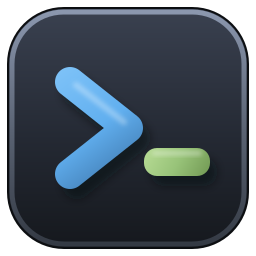
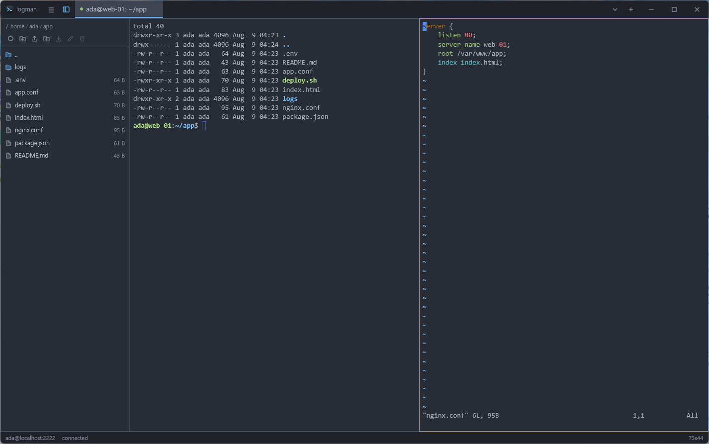
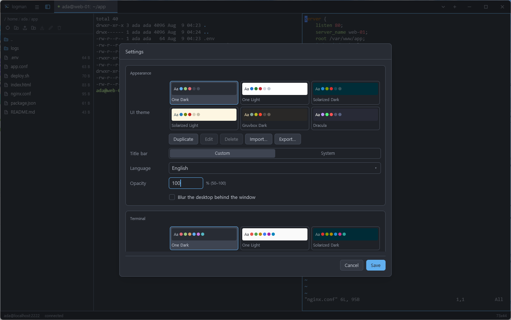
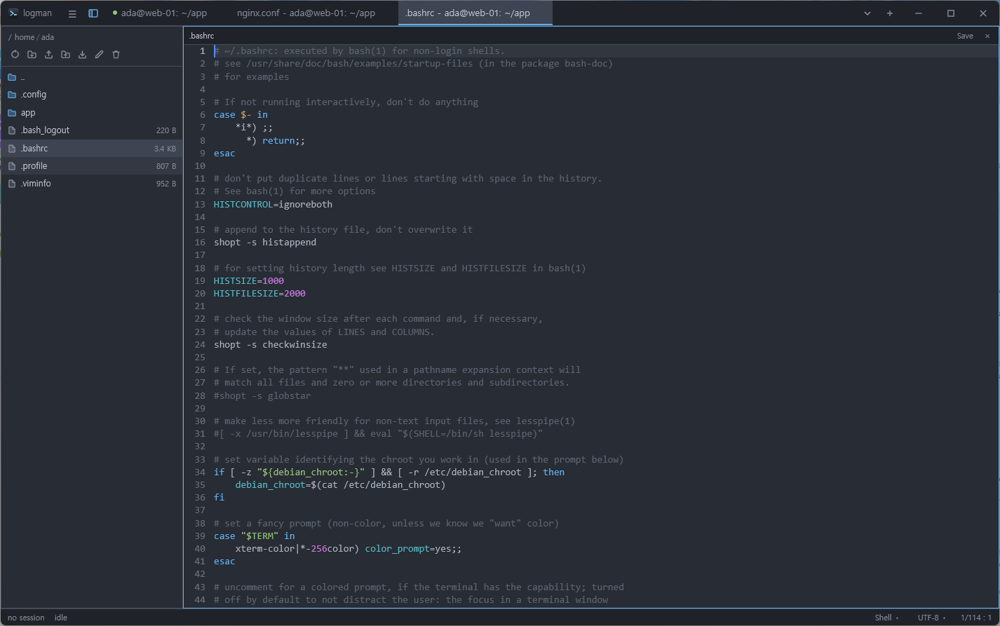
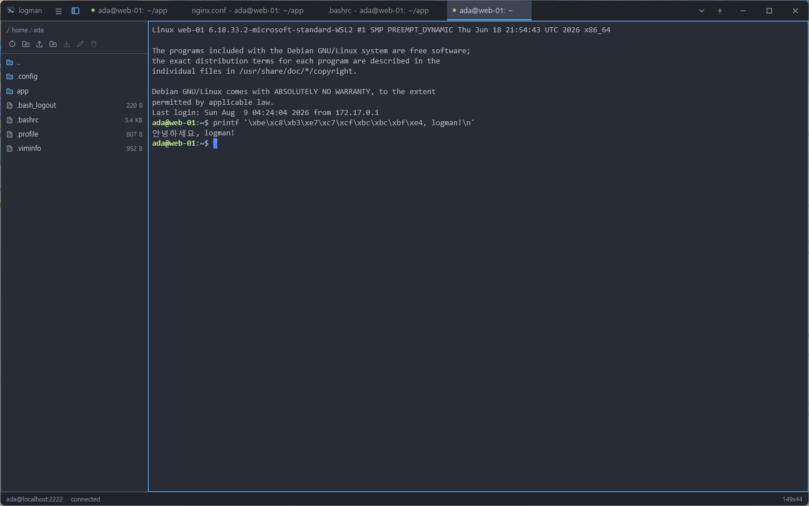

#  rulogman

[](https://github.com/xcomart/rulogman/actions/workflows/ci.yml)
[](https://github.com/xcomart/rulogman/releases)
[](LICENSE)


A multi-platform GUI SSH terminal written in Rust, built on
[gpui](https://gpui.rs) — the GPU-accelerated UI framework behind the Zed editor.



<details>
<summary>The settings dialog: theme cards, title bar, language, opacity, and the terminal schemes under them</summary>



</details>

<details>
<summary>The built-in editor: a file on the server, in a tab of its own</summary>



</details>

<details>
<summary>A host that speaks EUC-KR: raw bytes in, Korean on the grid</summary>



</details>

## What it does

What follows is the tour. [docs/user-guide.md](docs/user-guide.md) is the
manual — every screen, setting and shortcut in full — and each paragraph below
links into the part of it that covers the same ground.

**Profiles and connecting.** Press <kbd>Ctrl</kbd>+<kbd>T</kbd>
(<kbd>Cmd</kbd>+<kbd>T</kbd> on macOS), give the dialog a host, a user and
either a password or a private key, and connect. The profile is saved as you go,
so the second connection to that host is one click from the start screen — and
a profile whose credentials are already to hand, a remembered password or a key
that needs no passphrase, connects from that list without the dialog opening at
all. See [Getting started](docs/user-guide.md#getting-started).

**A shell on this computer, too.** Not every terminal is on another machine. The
start screen and the connection dialog both offer the shells this computer can
start — your login shell on Linux and macOS; PowerShell, `cmd` and one row per
installed WSL distribution on Windows — and choosing one opens it in a tab like
any other session, with no host to reach and nothing to authenticate. A WSL row
opens a Linux shell standing in the distribution's own filesystem, which the
files panel beside it browses as such. Give rulogman a path — on the command
line, or by opening a folder with it from a file manager — and it starts one
there instead of showing the start screen, a tab per path, with a file taken to
mean the directory holding it; on Linux it can also stand in as the desktop's
default terminal, opening in whatever folder it was launched from. See
[A shell on this computer](docs/user-guide.md#a-shell-on-this-computer).

**Tabs and split panes.** Every session gets a tab, with its own connection and
its own scrollback, and the tab strip doubles as the window's title bar in the
VS Code manner — with the system caption one setting away for those who prefer
it. One shortcut splits the focused pane into a second connection to the same
host, and a right-click pulls an existing tab in beside the one you are looking
at instead; the divider between two panes drags to give either as much room as
it needs. A pane closes itself when its connection ends, while a session that
*failed* to connect stays put with the error and a **Reconnect** button. See
[Tabs and sessions](docs/user-guide.md#tabs-and-sessions) and
[Split panes](docs/user-guide.md#split-panes).

**Follow a log beside the shell.** A profile can carry a list of absolute paths
on the server — **Tail files** in the connection dialog — and connecting opens
the shell with one pane per file in the same tab, the shell on top and the files
stacked below it at equal heights. Each pane is an SSH session of its own
running `tail -n 200 -F`, so a file that rotates keeps flowing, and a strip
above it names the path — shortened from the left when the pane is narrow,
`/v/l/nginx/access.log`, never in the file name itself, with the whole path on
hover and the connection's name beside it when a tab mixes hosts. Input to a
tail pane is ignored, so a stray <kbd>Ctrl</kbd>+<kbd>C</kbd> cannot kill the
tail, while scrollback, selection and copy work as they do anywhere else. Such
a pane has no files panel and never takes the profile's forwarded ports, and it
offers **Reconnect** if the connection drops. A single file can also be followed
on its own, from the connection row's menu on the start screen or a tab's
right-click menu. See [Followed files](docs/user-guide.md#followed-files).

**Port forwarding saved with the profile.** Each rule listens on a port of this
computer and forwards it through the session to a host the server can reach, and
the rules open as soon as the shell is up. The tab holding them says so with a
mark that names them, and it is only ever one tab: a second session on the same
profile connects as usual and leaves the ports where they are, rather than
fighting for them. When that tab goes, the next session on the profile picks
them up. See [Port forwarding](docs/user-guide.md#port-forwarding).

**Through a bastion.** The **Jump hosts** section of the connection dialog takes
an ordered chain of hops, each with its own host, port and user, and its own
password or private key held in the OS credential store. Connecting then dials
the way `ssh -J` does: every next hop is reached through a `direct-tcpip`
channel of the one before it, and each hop's host key is verified under its own
name. When a hop refuses, the error says which one and what it was asked for —
*jump host bastion:22 refused the connection to web-01:22 — most likely
AllowTcpForwarding is disabled* — rather than blaming the destination. Shells,
followed files and dashboard panes on that profile all travel the same chain.
See [Jump hosts](docs/user-guide.md#jump-hosts).

**Dashboards: every log, one screen, one click.** A dashboard is a named set of
followed files spanning any number of connections — the name, the rows of
connection and path, and whether it opens at startup, all edited in the settings
dialog's **Dashboards** section. Opening one is a click in the start screen's
**Dashboards** list, or <kbd>Ctrl</kbd>/<kbd>Cmd</kbd>+<kbd>Alt</kbd>+<kbd>1</kbd>…<kbd>9</kbd>,
or `rulogman --dashboard "Morning"` on the command line, which repeats for as
many as you want open at once. The tab takes the dashboard's name and lays its
panes out as a balanced grid — two side by side, three as two over one, four as
2×2. Drag the dividers, close what you are not watching, add any connection's
followed file below the active pane from the tab menu, and **Save layout to
dashboard** (<kbd>Ctrl</kbd>/<kbd>Cmd</kbd>+<kbd>Shift</kbd>+<kbd>L</kbd>)
records that pane set and its geometry for the next open; editing the file list
in settings sets a saved layout aside for the grid rather than losing anything.
Every connection involved needs its credentials saved, or the connection dialog
opens on the first one that lacks them. See
[Dashboards](docs/user-guide.md#dashboards),
[Arranging and saving the layout](docs/user-guide.md#arranging-and-saving-the-layout)
and [Opening at startup and from the command line](docs/user-guide.md#opening-at-startup-and-from-the-command-line).

**Settings that belong to one host.** A profile can override the color scheme,
the font size, the scrollback depth, `TERM` and the character set for its
sessions alone; every field is blank by default, and blank inherits the global
value. The character set is the one with nothing global behind it, deliberately
— it describes a host rather than a preference, so a host whose locale reads
`ko_KR.euc-kr` gets **EUC-KR** on its own profile and everything you type,
paste or compose leaves in the encoding it came in. See
[Session overrides](docs/user-guide.md#session-overrides).

**A files panel beside the terminal.** It browses the filesystem of the session
in the focused pane — a server over SFTP on a channel of the same connection,
this computer off its own disk, a WSL distribution through the share Windows
already serves for it — and it follows the shell's `cd` when the shell announces
one. The header path is a breadcrumb whose every piece drops down the
directories beside it, whole folders can be dragged in or saved out with a
progress bar while they move, and each session keeps its own directory,
selection and scroll position. See
[The files panel](docs/user-guide.md#the-files-panel).

**An editor built in.** Right-click a file in the panel and pick **Edit**, and
it opens in a tab of its own with line numbers, undo, find and replace, a
comment toggle and syntax highlighting for twenty formats, drawn in the
session's own color scheme and terminal font; <kbd>Ctrl</kbd>+<kbd>S</kbd>
writes it back over the connection it came from. The text surface itself is
[`rugpui-editor`](https://github.com/xcomart/rugpui), the same widget the sibling
database tools are written against; what rulogman adds to it is the palette,
derived from the session's terminal color scheme so that the two panes of a
split read as one surface. Files up to 10 MB open, in UTF-8 or one of eight
legacy character sets, and the status bar names both the character set and the
file type — either one can be changed there when the guess was wrong. Beyond
the twenty, a language of your own is one YAML file in the `syntaxes`
directory. See [The editor](docs/user-guide.md#the-editor) and
[Defining a language](docs/user-guide.md#defining-a-language).

**A real terminal, not a log view.** `alacritty_terminal` drives the emulation,
so colors, cursor addressing, the alternate screen and full-screen programs —
vim, tmux, htop, less — behave the way they do in any other terminal. Selection,
copy on select, bracketed paste and a scrollback as deep as you set it all work
as expected, and dead keys, compose sequences and IMEs go through the platform's
own text input path. See [The terminal](docs/user-guide.md#the-terminal).

**Themes and color schemes, picked independently.** The UI theme colors the
chrome and the color scheme colors the terminal grid; six of each ship under
matching names, and every card in either picker previews the palette it stands
for. Both are files beyond that, and **scheme files are Windows Terminal's
format**, so the thousands of palettes published for it work unchanged. Nothing
has to be edited by hand either: duplicate, edit, delete, import and export sit
under each picker, and a palette saved in the editor repaints the window or
every open session at once. See
[Themes and colour schemes](docs/user-guide.md#themes-and-colour-schemes).

**Your language and your font.** The interface ships in eight languages and
follows the system locale unless told otherwise, the terminal font is picked
from the fonts actually installed on the machine, and the rest of the settings
dialog covers the title bar style, window opacity and blur, scrollback, `TERM`,
copy-on-select and the defaults new connections start from. Everything lands in
a `settings.json` that is meant to be edited by hand, where out-of-range values
are clamped rather than allowed to break the application. See
[Settings](docs/user-guide.md#settings).

**Driven from the keyboard.** Tabs, panes, splits, the files panel, the settings
dialog and the editor all have shortcuts, chosen to stay out of the remote
shell's way — the pane commands avoid a bare <kbd>Ctrl</kbd> because
<kbd>Ctrl</kbd>+<kbd>[</kbd> is ESC to a shell, and the files panel takes a
shifted chord because <kbd>Ctrl</kbd>+<kbd>B</kbd> is tmux's prefix key. Every
icon button names itself and its shortcut when the pointer rests on it. See
[Keyboard shortcuts](docs/user-guide.md#keyboard-shortcuts).

**Host keys and secrets.** Host keys are checked on the trust-on-first-use
convention, recorded per host, port and algorithm in a `known_hosts` file of
rulogman's own; a changed fingerprint aborts the connection rather than prompting,
and logs both the stored and the presented key. Passwords and key passphrases
are never written to any of the configuration files — they go to the OS
credential store, and only when you ask for them to be remembered. See
[Data and security](docs/user-guide.md#data-and-security).

**It can update itself.** rulogman asks GitHub once per launch whether a newer
release exists, silently ignoring every way that question can fail, and offers
the answer in a dialog you can act on, defer, or silence for that version.
**Update** downloads the build for this platform, checks it against the size and
SHA-256 digest the release published, unpacks it beside the installed copy and
moves it into that copy's place before restarting into it — nothing elevated,
nothing written outside the installation directory, and the release page in a
browser as the fallback wherever that cannot work. See
[Updating](docs/user-guide.md#updating).

## Installing

Prebuilt binaries for Windows, macOS and Linux are attached to every
[GitHub release](https://github.com/xcomart/rulogman/releases).

### Linux

The Linux archive holds the binary, a desktop entry, icons and an `install.sh`
that puts them under `~/.local` for the current user — no root needed:

```bash
tar xzf rulogman-<version>-x86_64-unknown-linux-gnu.tar.gz
cd rulogman-<version>-x86_64-unknown-linux-gnu
./install.sh
```

The binary lands in `~/.local/bin/rulogman`; the desktop entry is written with
that absolute path, so the launcher in your application menu works whether or
not `~/.local/bin` is on your `PATH` (add it if you want to start rulogman from
a shell too).

The binary is dynamically linked against the X11 half of xkbcommon, which most
desktops do not ship by default. Install it before the first launch, or the
program exits at once with a missing `libxkbcommon-x11.so.0`:

```bash
sudo apt install libxkbcommon-x11-0        # Debian, Ubuntu
sudo dnf install libxkbcommon-x11          # Fedora
sudo pacman -S libxkbcommon-x11            # Arch
```

### Windows warns before the first launch

The Windows executable and the installer built around it are
Authenticode-signed, but with a self-signed certificate: there is no
certificate from a commercial authority behind the project, and SmartScreen
judges a publisher by reputation rather than by signature. So the first launch
of a fresh download is met with **"Windows protected your PC"** and a
publisher of *Unknown*. The signature is a tamper seal, not a reputation — it
proves the file is the one the release workflow built and nothing more — and
the warning is SmartScreen saying exactly that.

Two clicks get past it: **More info**, then **Run anyway**. That is all the
installer (`rulogman-<version>-x86_64-pc-windows-msvc-setup.exe`) needs; once
it has run, rulogman starts from the Start menu without the question. The
browser may object before Windows does — Edge and Chrome hold back a download
that "isn't commonly downloaded" — in which case open the downloads list and
choose **Keep** (in Edge, **⋯ → Keep → Keep anyway**).

The warning is attached to the file rather than to the program: the browser
marks what it downloaded as coming from the internet, and SmartScreen acts on
the mark. So it can also be cleared at the file instead of answered at launch —
right-click it, **Properties**, tick **Unblock**, **OK** — or from PowerShell:

```powershell
Unblock-File .\rulogman-<version>-x86_64-pc-windows-msvc-setup.exe
```

The same goes for the zip archive. Explorer's own *Extract All* carries the mark
onto every file it unpacks, so the `rulogman.exe` inside asks the same question
the installer would; unblock the archive before extracting, or the executable
after. A copy built from source (below) carries no mark, and no signature.

To see the signature itself, right-click the file, **Properties**, **Digital
Signatures**. The certificate is the project's own and stays the same from one
release to the next, so a thumbprint that changed between two releases is worth
a second look.

### macOS refuses to open a downloaded copy

The macOS bundle is ad-hoc signed but not notarized — there is no Apple
Developer account behind it — so Gatekeeper quarantines what the browser
downloaded and blocks the first launch with "rulogman.app cannot be opened"
or claims the app is damaged. The app is fine; the quarantine flag is the
whole problem. After moving `rulogman.app` into `/Applications`, clear it:

```bash
xattr -r -d com.apple.quarantine /Applications/rulogman.app
```

The next launch — and every one after it — opens normally. If running
unsigned commands from the terminal is not your thing, the long way around
works too: try to open the app once, then allow it under **System Settings →
Privacy & Security → Open Anyway**. A copy built from source (below) never
gets the quarantine flag in the first place.

### macOS cannot reach a host on your own network

Since macOS 15, connecting to an address on the local network — a NAS, a
Raspberry Pi, anything with a `192.168.*` address — needs a permission of its
own. The first such connection makes macOS ask whether rulogman may find and
connect to devices on your network; allow it and SSH to those hosts works from
then on. If the connection times out for a machine sitting right next to you
while everything on the internet connects fine, the permission was denied —
sometimes silently, without the question ever appearing. Turn it on under
**System Settings → Privacy & Security → Local Network**, where rulogman appears
after its first attempt. Releases before 0.3.7 did not declare the permission,
so on some systems they were denied without a prompt; updating fixes that.

## Building

Requires a Rust toolchain (edition 2024, so 1.85 or newer) and a platform
compiler toolchain — MSVC on Windows, Xcode command line tools on macOS, a C
compiler and the usual X11/Wayland development packages on Linux.

```bash
cargo run --release -p rulogman-app
```

The SSH layer deliberately uses russh's `ring` backend instead of the default
`aws-lc-rs`. `aws-lc-rs` needs NASM to build on Windows, which would make a
clean checkout fail to compile there; `ring` builds everywhere with no extra
tooling. Do not re-enable russh's default features.

### The widget kit and the shell above it live in their own repository

Every view rulogman draws is built out of [`rugpui`](https://github.com/xcomart/rugpui):
the theme layer, the text field, the tab strip, the menus, the dialogs, the
overlay scrollbars. Its `rugpui-editor` crate is the text surface a file opens in
— the rope, the incremental syntax cache, the find bar and the languages it
lexes. Both are a repository of their own because they are shared with the
sibling database tools, and nothing in either knows what a session or a terminal
is; rulogman kept an editor of its own until that crate was published, and what
is left here is the two halves the widget has no business knowing — which
colours a *terminal* scheme implies, and which languages this application
ships.

`rugpui-shell` is the layer *above* the widgets, out of the same repository and
for the same reason: the window that draws its own title bar, its caption
buttons and resize grips, the self-updater and its dialog, the about box, the
palette catalogues and their colour editor, the split-pane tree and the pieces a
settings form is built out of were application code that three applications had
each written once. It knows nothing about rulogman — `main` injects the name,
the version, the release endpoints, the payload, the words and the
ignored-release tag before the first window opens — and what stays here is what
only rulogman can answer: the workspace, what a tab is, the settings form
itself, the terminal colour schemes as a catalogue, and the restart after an
update.

The manifest takes it as a **git dependency**, pinned to a revision rather than
a branch, so building rulogman needs nothing beyond a normal checkout:

```bash
git clone https://github.com/xcomart/rulogman
cd rulogman && cargo build
```

The patch tables below point five more crates — the four `rugpui` vendors, plus
its narrowed `unicode-width` — at that same URL and the same revision as the
three `rugpui` crates themselves; a git dependency is identified by URL and
revision together, so naming the revision everywhere is what keeps them one
checkout of `rugpui` rather than several, and what keeps `gpui` linked exactly
once. Moving to a newer revision means bumping all eight occurrences together.
Working on `rugpui` and rulogman side by side still works: an uncommitted
`.cargo/config.toml` here can carry its own
`[patch."https://github.com/xcomart/rugpui"]` table pointing these at a sibling
checkout by `path` instead.

### gpui comes from git, and four of its crates are vendored in `rugpui`

gpui's newest crates.io release is 0.2.2, and it predates the split of the crate
into a platform-independent core (`gpui`), a façade that links a backend in
(`gpui_platform`) and the backends themselves (`gpui_linux`, `gpui_macos`,
`gpui_windows`). rulogman is written against that split, so both `gpui` and
`gpui_platform` are git dependencies on one pinned revision of Zed's monorepo —
a revision and never a branch, so that two checkouts build the same application.

Four of those crates are vendored under `rugpui`'s `vendor/` and patched back over
the git source through `[patch."https://github.com/zed-industries/zed"]` in this
workspace's manifest. rulogman no longer keeps copies of its own: the widgets and
the patched framework they are written against are one repository, so a fix made
once is a fix in every application that draws with them. Each vendored copy is
the upstream directory with its manifest flattened — workspace inheritance
resolved, sibling crates repointed at the same revision — and every change to the
code marked `RULOGMAN PATCH`, after the project the trees were first grown in, so
a diff against the upstream tree at that revision shows exactly what is carried:

- **`Window::set_titlebar_transparent`.** Upstream decides at window creation
  whether the platform caption exists, and offers no way back. This API flips it
  on a live window, which is what lets the title-bar setting apply without
  reopening the window and losing the sessions inside it. It has to reach the
  backends, so it is a `PlatformWindow` method — which is why the core is
  vendored at all, rather than only the two backends that implement it
  (`gpui_macos`, `gpui_windows`).
- **X11 close re-entrancy.** The WM_DELETE_WINDOW handler runs the close
  callbacks with the client `RefCell` borrowed, and both of them re-enter the
  application, where anything that reaches the platform borrows the same cell
  and panics with "already borrowed". Upstream learnt half of it when the crate
  was split — `close()` now runs outside the borrow, which is what rulogman's
  quit-from-window-closed-observer needs — but `should_close()` did not move.
  rulogman registers no `on_should_close` handler today; the patch is what keeps
  that from being a condition of closing a window.
- **X11 transparency under client-side decorations.** `is_transparent` ignored
  them, unlike its Wayland counterpart, so the transparent shadow band around a
  self-decorated window composited as solid black.
- **X11 blur behind.** The X11 backend has no counterpart to the Wayland one's
  `org_kde_kwin_blur`, so a blurred background appearance did nothing on KDE
  X11; `update_blur_region` keeps KWin's `_KDE_NET_WM_BLUR_BEHIND_REGION` in
  step with the window.
- **macOS 26 blur behind.** Liquid Glass rebuilds the private layer tree under
  an `NSVisualEffectView`, so upstream's effect-view path on macOS 26 (Tahoe)
  and later leaves a window merely translucent, with nothing blurred behind
  it. On 26 and up, `set_background_appearance` blurs the way gpui 0.2.2 did
  instead, calling the legacy WindowServer private API
  `CGSSetWindowBackgroundBlurRadius` directly (radius 80, back to 0 for
  Opaque/Transparent).

Moving the revision forward means re-flattening the manifests and replaying the
marked hunks, in `rugpui`. Delete a hunk, and then the vendored crate once it holds
none, whenever upstream grows its own answer.

A fifth vendored tree lives beside them, `rugpui`'s `vendor/unicode-width`, and is
patched in here through `[patch.crates-io]`. It narrows the handful of symbol
ranges Unicode 16 widened and the deployed `wcwidth` implementations did not, so
that the grid advances by the same count the applications drawing into it use —
the visible symptom without it is vim-airline's `☰` overflowing the status line.
`alacritty_terminal` calls `UnicodeWidthChar::width` directly with no hook to
supply a width policy, which is why this is a patch rather than a call site.

### Release builds on Windows need `fxc.exe`

`gpui_windows` precompiles its HLSL shaders only in release builds — debug
builds compile them at runtime — so `cargo build --release` needs `fxc.exe` from
the Windows SDK. It looks on `PATH`, then at the newest SDK the registry knows
about; an SDK that neither knows fails the build with `Failed to find fxc.exe`.
Point it at the right file:

```powershell
$env:GPUI_FXC_PATH = "D:\Windows Kits\10\bin\10.0.26100.0\x64\fxc.exe"
cargo build --release
```

Debug builds do not need it.

### Testing

```bash
cargo test --workspace
```

`rulogman-ssh` is tested against a real SSH server: the integration suite starts an
in-process russh server on an ephemeral port with a freshly generated host key
and drives the actual client against it — password and public key
authentication (including an encrypted key), pty parameters, data round-trip,
`window-change`, host key rejection, and teardown. No fixture keys are committed
and no external server is needed.

## How it is put together

| Crate | Responsibility |
| --- | --- |
| `rulogman-core` | Profiles — jump-host chains and followed files among the data they carry — dashboards in a `dashboards.json` of their own, OS keychain, `known_hosts`, config paths. No SSH, no GUI. |
| `rulogman-ssh` | russh client: authentication, pty, shell, resize, and the SFTP channel behind the files panel. Dials a chain of jump hosts as a fold over the hops and the target, and can run a command in place of the shell, which is what a followed file is. Owns its own thread and Tokio runtime. |
| `rulogman-pty` | The local shell transport: a unix pty on one side, a Windows ConPTY on the other, behind one API. |
| `rulogman-term` | `alacritty_terminal` wrapper: byte stream in, styled snapshot out; key encoding, and the transcoding at both edges for a session that is not UTF-8. No GUI. |
| `rulogman-app` | The gpui binary: views, terminal rendering, session management, the tail pane and the composition of a dashboard tab. The widgets it draws with come from `rugpui`, the editor surface from `rugpui-editor`, and the window chrome, updater and palette editor from `rugpui-shell`. |

Two boundaries are worth knowing about.

**SSH never blocks the UI.** Each session owns a dedicated thread running its own
Tokio runtime, and talks to the GUI only over channels. A hung network read
cannot stall a repaint.

**The terminal model knows nothing about gpui, and the GUI knows nothing about
russh.** `rulogman-term` turns bytes into a `TerminalSnapshot` of styled runs, and
that is all the renderer sees. Both lower crates are testable without a window:
most of the workspace's tests need neither a GUI nor a network, and the ones
that reach the network need only loopback.

### Third-party libraries

The heavy lifting is done by these projects:

| Library | Role |
| --- | --- |
| [gpui](https://github.com/zed-industries/zed/tree/main/crates/gpui) | GPU-accelerated UI framework, from the Zed editor (a pinned git revision, partly [vendored and patched](#gpui-comes-from-git-and-four-of-its-crates-are-vendored)) |
| [russh](https://github.com/warp-tech/russh) | Pure-Rust SSH client: transport, authentication, pty and shell channels |
| [russh-sftp](https://github.com/AspectUnk/russh-sftp) | SFTP client for the remote files panel, on a channel of the same connection |
| [alacritty_terminal](https://github.com/alacritty/alacritty) | Terminal emulation: grid, VTE parsing, scrollback — and the unix pty behind a local session |
| [portable-pty](https://github.com/wez/wezterm/tree/main/pty) | The Windows ConPTY behind a local session |
| [tokio](https://github.com/tokio-rs/tokio) | Async runtime for the SSH transport thread |
| [keyring](https://github.com/open-source-cooperative/keyring-rs) | OS credential store: Windows Credential Manager, macOS Keychain, Secret Service |
| [directories](https://github.com/soc/directories-rs) | Per-platform configuration paths, and the home directory the save dialog opens in |
| [ureq](https://github.com/algesten/ureq) | The one HTTPS client: the update check, and the download the self-update runs on |

Supporting crates:
[serde](https://github.com/serde-rs/serde) /
[serde_json](https://github.com/serde-rs/json) (profiles and settings),
[tempfile](https://github.com/Stebalien/tempfile) (staging a file being opened
or saved),
[uuid](https://github.com/uuid-rs/uuid) (profile identity),
[anyhow](https://github.com/dtolnay/anyhow) /
[thiserror](https://github.com/dtolnay/thiserror) (errors),
[log](https://github.com/rust-lang/log) /
[env_logger](https://github.com/rust-cli/env_logger) (logging),
[futures](https://github.com/rust-lang/futures-rs) /
[async-trait](https://github.com/dtolnay/async-trait) (async glue),
[parking_lot](https://github.com/Amanieu/parking_lot),
[smallvec](https://github.com/servo/rust-smallvec),
[bitflags](https://github.com/bitflags/bitflags),
[unicode-segmentation](https://github.com/unicode-rs/unicode-segmentation)
(grapheme-safe text editing).

Windows only: [windows-rs](https://github.com/microsoft/windows-rs) (DWM
caption colors), [raw-window-handle](https://github.com/rust-windowing/raw-window-handle)
(HWND access), [winresource](https://github.com/BenjaminRi/winresource)
(icon embedding). Tests additionally use
[rand](https://github.com/rust-random/rand).

## Limitations

The honest headlines, one line each:

- **No SSH agent support and no keyboard-interactive authentication**, so
  MFA-protected servers cannot be reached yet, and every jump host in a chain
  needs a password or a key of its own.
- **IME composition is verified only against the Microsoft Korean IME on
  Windows**, and not at all on the X11 and Wayland input methods.
- **The files panel cannot change permissions or ownership**, and a transfer or
  a delete cannot be cancelled once it has started.
- **The editor opens text and nothing else**, up to 10 MB, saves without
  atomicity, and notices nothing that changes the file underneath it.
- **Panes can be resized but not dragged to rearrange** — only added below the
  active pane, or closed — and only a dashboard's layout survives a restart,
  saved on demand; an ordinary tab's split and the files panel's width do not.
- **Runtime palette changes are ignored**: a program that redefines colors with
  `OSC 4` or `OSC 10`–`11` renders with the static scheme.

The full list, with the reasoning behind each one, is in the guide:
[Known limitations](docs/user-guide.md#known-limitations).

## License

MIT — see [LICENSE](LICENSE). The vendored gpui crates are no longer carried
here; they keep their own Apache-2.0 notices in `rugpui`, under
`rugpui/vendor/gpui/`, `rugpui/vendor/gpui_linux/`, `rugpui/vendor/gpui_macos/` and
`rugpui/vendor/gpui_windows/`.
