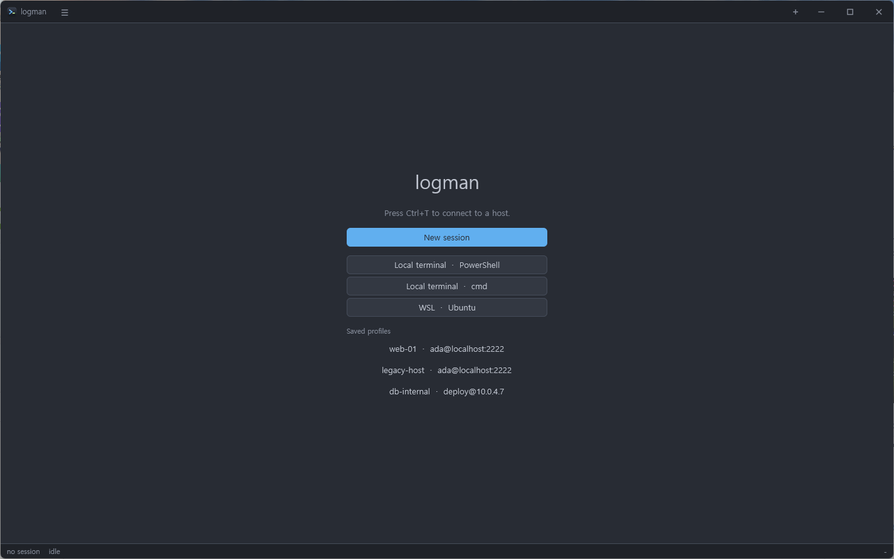
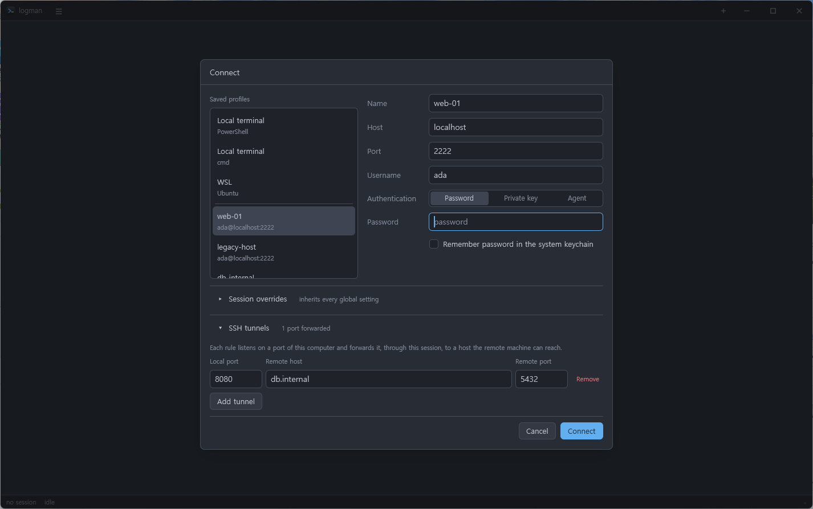
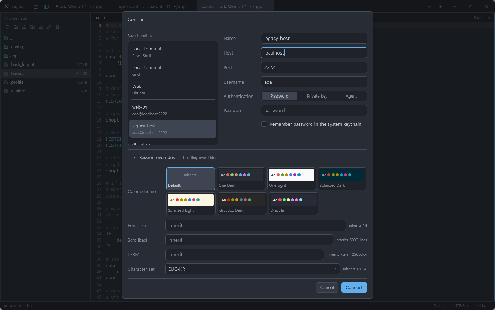
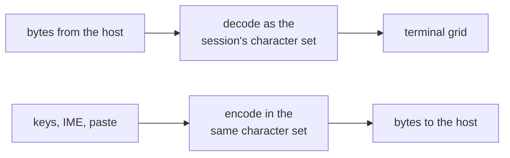
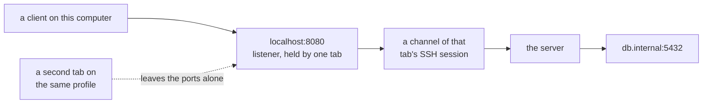
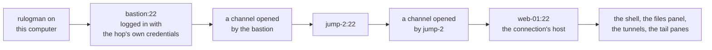
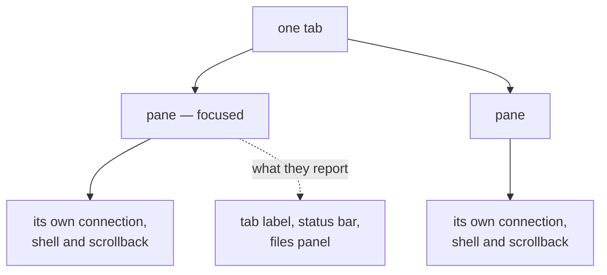
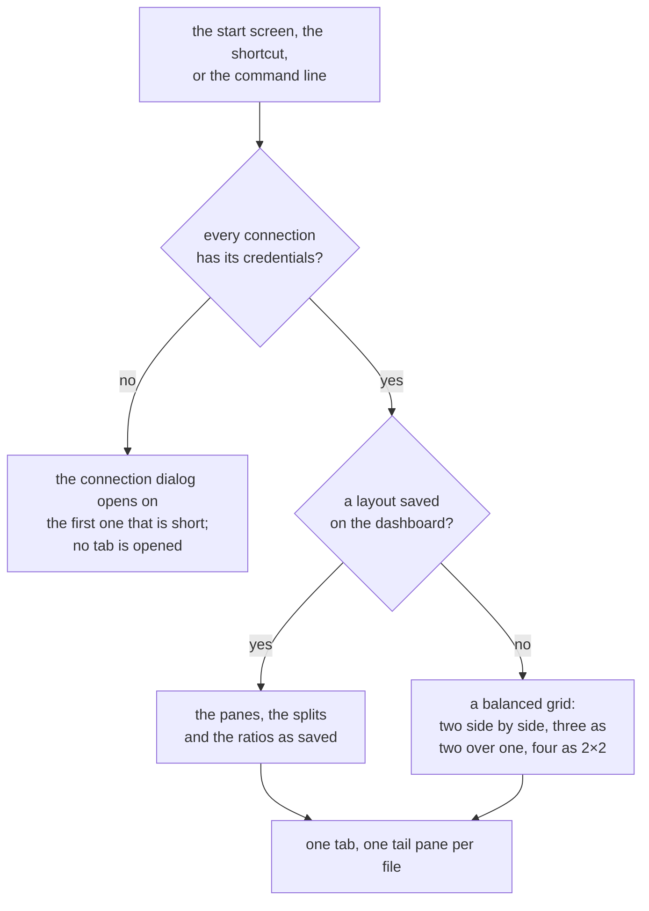
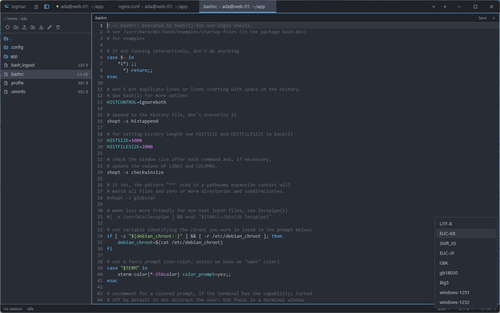

# rulogman user guide

rulogman is a GUI SSH terminal: one window, a strip of tabs, a real terminal in
each of them — a remote one over SSH, or a shell on this computer — a file
browser beside it, and an editor for the files that browser finds. This guide
covers everything the application does. The [README](../README.md) is the short
version.


## Contents

- [Getting started](#getting-started)
- [Tabs and sessions](#tabs-and-sessions)
- [Split panes](#split-panes)
- [Dashboards](#dashboards)
- [The files panel](#the-files-panel)
- [The editor](#the-editor)
- [The terminal](#the-terminal)
- [Settings](#settings)
- [Updating](#updating)
- [Keyboard shortcuts](#keyboard-shortcuts)
- [Data and security](#data-and-security)
- [Troubleshooting](#troubleshooting)

## Getting started

### Starting the application

Run the packaged binary, or build from a checkout:

```bash
cargo run --release -p rulogman-app
```

On Linux the packaged binary needs `libxkbcommon-x11-0` (`libxkbcommon-x11` on
Fedora and Arch) installed on the machine, and the archive's `install.sh` puts
the binary, desktop entry and icons under `~/.local` for the current user; the
[README](../README.md#linux) walks through both.

The window opens at 1100×700, centred, showing the start screen: the wordmark, a
hint naming the new-session shortcut, a **New session** button, one button per
shell this computer can start, and — once you have connected to something at
least once — a list of saved profiles, with any [dashboards](#dashboards) you
have made listed above them.



*The shell rows are what this machine has — a Windows one here. On Linux and
macOS there is a single row, your login shell.*

**Clicking a saved profile there connects straight away** when the credentials
are already to hand: a password remembered in the keychain, or a key that needs
no passphrase. Only a profile with something still missing opens the connection
dialog, pre-filled from it, and a right-click on the row offers the profile
commands without connecting at all.

**New window** — in the menu next to *New session*, or
<kbd>Ctrl</kbd>+<kbd>Shift</kbd>+<kbd>N</kbd>
(<kbd>Cmd</kbd>+<kbd>N</kbd> on macOS) — opens a second window on the same
rulogman, stepped down and across from the one you asked from. Each window keeps
its own tabs, and a tab belongs to the window it was opened in; the settings,
the saved profiles and the themes are shared, so applying a setting in one window
reaches all of them. Closing the last window still quits the application. A tab
you already have can be sent into a window of its own instead — see
[Moving a tab to a window of its own](#moving-a-tab-to-a-window-of-its-own).

### Starting somewhere in particular

**Give rulogman a path and it opens a shell standing in it**, in place of the
start screen:

```bash
rulogman /var/log
```

A file works as well as a directory — `rulogman /etc/nginx/nginx.conf` opens the
shell in `/etc/nginx` — and several paths open a tab each, in the order given. A
path that is not there is skipped with a line in the log, and the window opens
on the start screen as it otherwise would.

This is what makes rulogman an **Open with** target for a folder. On Linux the
installed desktop entry offers it for one, so a file manager lists rulogman
beside the file managers' own terminals. On macOS the Finder's *Open with*
submenu lists it for anything, folder or file, without ever making it the
default for a type; `open -a rulogman /var/log` does the same from a shell, and
opening a second folder that way adds a tab to the window already up rather than
starting rulogman twice. On Windows, pass the path to `rulogman.exe`.

On Linux, rulogman can also be set as the desktop's default terminal — on KDE,
**System Settings → Default Applications → Terminal emulator**. Chosen that
way, a file manager's *Open Terminal Here* starts rulogman with the folder as
the child process's working directory rather than as a command-line argument,
which is the only handle the desktop gives a terminal it does not otherwise
know how to drive. rulogman reads it back out: a launch with no paths that
starts somewhere other than your home directory is treated as a request for a
shell there. So typing `rulogman` in a shell already standing in a project
directory opens a shell in that same directory, while the desktop icon and
application menu, which both start it in your home, still open the start
screen.

**`--dashboard` overrides that fallback.** A launch that names a dashboard is a
launch that has already been told what to open, so the launch directory is not
read back out and no shell is opened for it; the dashboard's tab is what comes
up. Paths are unaffected — the flag is pulled out of the command line before the
paths are, so `rulogman --dashboard Morning /var/log` opens both, the dashboard
first. See
[Opening at startup and from the command line](#opening-at-startup-and-from-the-command-line).

### The connection dialog

<kbd>Ctrl</kbd>+<kbd>T</kbd> (<kbd>Cmd</kbd>+<kbd>T</kbd> on macOS), the **New
session** button, or the **+** at the right of the tab strip opens the dialog.
It has two columns: saved profiles on the left, the connection form on the
right.



*The collapsible sections along the bottom — **Session overrides**, **Jump
hosts**, **SSH tunnels** and **Tail files** — summarise themselves while closed,
so a profile's extras are readable without opening any of them.*

The form:

| Field | What it does |
| --- | --- |
| **Name** | Label for the tab and the profile list. Left empty, it becomes the host name. |
| **Host** | Host name or address. Required. |
| **Port** | Digits only. Empty means 22. Anything outside 1–65535 is refused. |
| **Username** | The remote login name. Required. |
| **Authentication** | **Password**, **Private key** or **Agent**. |
| **Password** | Masked. Shown in password mode. |
| **Key file** | Path of the private key, with a **Browse…** button that opens the platform file picker. Shown in private key mode. |
| **Passphrase** | Masked, optional — an unencrypted key needs none. Shown in private key mode. |
| **Remember … in the system keychain** | Writes the password or passphrase to the OS keychain under the profile's identifier. |

**Agent authentication is offered but not implemented.** Choosing it disables
**Connect** and says so in the message strip, rather than failing later against
the server.

<kbd>Enter</kbd> in any field submits the form. If something is missing, the
message strip names the one thing to fix rather than listing everything.
<kbd>Tab</kbd> and <kbd>Shift</kbd>+<kbd>Tab</kbd> walk the controls;
<kbd>Esc</kbd>, the **Cancel** button and a click on the backdrop all dismiss
the dialog.

### Session overrides

**Session overrides** is a collapsible section at the bottom of the form. It
holds a color scheme, a font size, a scrollback depth, a `TERM` value and a
character set that apply to this profile alone. Every field is blank by default,
and blank means "inherit the global setting" — the placeholder says *inherit*,
and the header summarises how many settings the profile overrides. Opening a
profile that has overrides expands the section automatically.



*One setting overridden, and the header says so. Every field that is still blank
names the global value it is taking.*

**The character set** is the one override with nothing global behind it, and its
first row says *Default* rather than *inherit* for that reason: what it inherits
is UTF-8, and no setting anywhere changes that. A character set describes a host
rather than a preference — a global one would only ever be a way to break every
modern session at once in order to fix one legacy one — so it is set on the
profile of the host that needs it and nowhere else. That is the host whose locale
reads something like `ko_KR.euc-kr` or `ja_JP.SJIS`: pick **EUC-KR** or
**Shift_JIS** and its output arrives as words, and everything you type, paste or
compose leaves in the same encoding it came in. Nine are offered — UTF-8, EUC-KR,
Shift_JIS, EUC-JP, GBK, gb18030, Big5, windows-1251 and windows-1252 — and one
outside that list can still be written into `profiles.json` by hand, where any
spelling the WHATWG encoding registry knows is accepted and one it does not falls
back to UTF-8.


*The bytes the host sent were `\xbe\xc8\xb3\xe7…`; the grid shows the words they
spell.*

A wrong choice costs nothing but legibility: the terminal fills with mojibake,
and the cure is to edit the profile and connect again. The decoder is installed
as the session starts, so a change takes effect on the next connect or reconnect
and never under a shell that is already running. A character the encoding has no
byte for — an emoji typed at a windows-1252 host — goes out as `?`, which is what
`iconv` and the terminals do; rulogman's own notices in the grid, such as a port
forwarding that failed, stay UTF-8 whatever the host speaks.

The character set sits at both edges of the session, not one:



*On UTF-8 — what every profile inherits — both steps pass the bytes through
unchanged, so this is machinery only a legacy host ever wakes up.*

### Port forwarding

**SSH tunnels** is the other collapsible section of the form — expanded in the
screenshot under [The connection dialog](#the-connection-dialog). Each rule listens
on a port of *this* computer and forwards it, through this session, to a host
the remote machine can reach — three fields: a **Local port**, a **Remote host**
and a **Remote port**. `8080`, `db`, `5432` forwards this computer's port 8080
to `db:5432` as seen from the server, so a client here connects to
`localhost:8080` and lands on the remote database. **Add tunnel** appends a row,
**Remove** takes one away, and the collapsed header counts the rules the profile
carries. A rule with a field left blank, or a port outside 1–65535, blocks
**Connect** until it is completed or removed — a session that forwards a port
you believe it forwards is the only kind worth opening.

The listeners open once the session's shell is up, and close with the session.
A tab whose session is holding forwardings wears a small tunnel mark after its
title; hovering it names the rules, `8080 → db:5432`. The mark is on exactly one
tab, because the ports can only be held by one:

**A second tab on the same profile does not take the forwardings.** Open, split
or duplicate a profile that is already forwarding and the new session connects
normally — same shell, same files panel — but leaves the ports to the tab that
has them, without asking and without a word in the terminal. Nothing is lost by
it: the forwardings are already running, and traffic through `localhost:8080`
reaches the same server either way.



The tab that holds them is the tab that opened them, and it keeps them until it
closes or its connection ends. Once it is gone the ports are free again, and the
next session to start on that profile takes them — either a new tab, or an
existing one reconnected with the **Reconnect** button. Reconnecting a tab
*while* another still holds them changes nothing: it comes back without them,
and the mark stays where it is.

**Every window counts, not just this one.** A port is bound once per computer,
so a tab holding forwardings holds them against the whole application — whether
it is in this window or in one you moved it to.

A rule can still fail, and then the terminal says so in yellow: something
outside rulogman holding the local port, or a remote host the server cannot reach.
A tab whose rules all failed holds nothing and wears no mark.

### Jump hosts

**Jump hosts** is the collapsible section above **SSH tunnels**, and it holds the
machines the connection is dialled *through* rather than to — the bastion in
front of a private network, and anything behind that one. It is an ordered list,
read top to bottom, and the target host of the form is always the last stop.

Each hop carries its own fields:

| Field | What it does |
| --- | --- |
| **Host** | The hop's host name or address. Required. |
| **Port** | Digits only, 22 by default. Anything outside 1–65535 is refused. |
| **User** | The login name on that hop. Required. |
| **Authentication** | **Password** or **Private key**. The SSH agent is not supported here any more than it is for the target. |
| **Key file** | Path of the private key, shown in private key mode. |
| **Password** / **Passphrase** | Masked. The secret for this hop alone. |

**A secret you type here is remembered in the system keychain**, and there is no
checkbox to say otherwise. A bastion is a machine you go through on the way to
work rather than a machine you visit, and a bastion password nobody remembered
would be a password asked for on every single connection. As with the target's
own password, leaving the field empty on a later edit keeps the secret already
stored and typing something new replaces it; removing the hop deletes what was
stored for it, and so does deleting the profile.

Connecting walks the list. rulogman dials the first hop and logs into it, then
asks *it* to open a channel to the second, and so on until the last hop opens
the channel to the host in the form — which is what OpenSSH's `-J` /
`ProxyJump` does, and by the same means, a `direct-tcpip` channel:



**Every hop is verified under its own host key**, against the same `known_hosts`
as any other server — a hop seen for the first time is trusted on first use and
recorded, and a hop whose fingerprint has changed fails the connection where it
stands. See [Host key policy](#host-key-policy).

Two things are refused early. **An unfinished hop blocks Connect**, exactly as an
unfinished tunnel rule does: a hop missing its host or user, a private-key hop
with no key path, a port outside the range. And **a password hop with nothing
stored fails the session before anything is dialled**, with a message naming the
hop and telling you to enter its secret in the connection's settings — there is
nowhere to ask for it once the connection is under way.

Failures on the way through name the hop that produced them rather than the host
you asked for, since that is where the fix is:

```text
jump host bastion:22 refused the connection to web-01:22 — most likely AllowTcpForwarding is disabled
```

**The hops belong to the profile, not to the tab.** Everything opened on that
connection goes the same way: its shell, a split of that shell, the files panel's
SFTP channel, the panes that follow files, and any dashboard pane that names this
connection.

### Followed files

**Tail files** is the last collapsible section of the form, under **SSH
tunnels**. It lists absolute paths on the remote machine, one per row, with
**Add file** and **Remove**; the collapsed header counts them, *2 files
followed*, so a profile's watchlist is readable without opening the section. A
row left blank is simply dropped when you connect — an empty path asks for
nothing, so there is nothing to refuse over.

**Connecting a profile that lists files opens the shell and the files together,
in one tab.** The shell takes the top of the tab and the files stack under it in
the order the rows are in, rows of equal height, so a tab opened on a web server
comes up as a prompt over its access log over its error log.

Each of those panes is a session of its own — its own SSH connection, on the same
credentials and through the same [jump hosts](#jump-hosts) — running

```bash
tail -n 200 -F /var/log/nginx/access.log
```

so it opens on the last two hundred lines and follows the file from there. The
flag is `-F` rather than `-f` deliberately: a log rotated out from under the
pane is reopened by name and followed again, instead of the pane going quiet for
the rest of the day.

A tail pane wears a header strip carrying the path, and the connection's name at
the right end when the tab has panes from more than one host. **The path is
shortened from the left** when the pane is too narrow for it —
`/var/log/nginx/access.log` becomes `/v/l/nginx/access.log` — because the file
name is what tells two logs apart and the directories above it are what you
already know; the name itself is never shortened, and resting the pointer on the
strip shows the path in full.

Three things about such a pane differ from a shell:

- **Keyboard input is ignored.** Nothing you type reaches the remote command, so
  a <kbd>Ctrl</kbd>+<kbd>C</kbd> aimed at the pane beside it cannot kill the
  tail. Everything else about the terminal works: the scrollback holds what has
  gone past, and the selection and copy keys behave as they do anywhere else.
- **There is no files panel over it.** The pane is a view of one file, and it has
  no shell to browse alongside.
- **It never takes the profile's port forwardings.** Those belong to the shell —
  see [Port forwarding](#port-forwarding).

When the connection behind a tail pane drops, the pane shows the same overlay
card any session does, **Reconnect** included, and reconnecting starts the tail
again from its last two hundred lines.

**A file can also be followed on its own.** The right-click menu of a saved
connection on the start screen, and the right-click menu of a tab already open on
one, both carry a row per path the profile follows, named after the file —
**Tail access.log** — and choosing one opens that file in a tab of its own,
with no shell beside it. If the profile's credentials are not saved, the
connection dialog opens first, pre-filled; the file is followed as soon as you
connect.

Several connections' files can be watched together in one tab, which is what a
[dashboard](#dashboards) is.

### Highlighting a followed file

**A tail pane recolours the lines it shows.** A highlight rule is a regular
expression and the colours to paint what it matches in, and every pane
following a file runs the same list over every line that arrives — the panes
under a profile's shell, a file opened on its own, and the panes of a
[dashboard](#dashboards) alike. Highlighting only ever changes colours:
nothing is filtered, folded or hidden, so the pane still shows you the file
exactly as `tail` sends it.

A rule carries:

| Part | What it means |
| --- | --- |
| **Pattern** | A regular expression, in Rust's `regex` syntax — `\b(error\|fail)\b`. |
| **Match** / **Line** | How far the colour reaches. **Match** paints the matched text alone; **Line** paints the whole line the match was found on, including the rows a long line wraps onto. |
| **Text** / **Background** | The two colours. Either can be left empty, and an empty one leaves that half of the line as the terminal drew it. |
| **Bold** | Draws the highlighted span bold. |
| **Ignore case** | On by default, since a log writes `ERROR`, `Error` and `error` and means the same thing by all three. |
| **On** | Clear it to keep a rule without applying it — for the rule you want back next week rather than retyped. |

**A colour is either a hex value or the name of a slot in the colour scheme.**
`#7f1d1d`, or its three-digit short form `#c00`, says exactly what to draw. A
slot name — `black`, `red`, `green`, `yellow`, `blue`, `purple`, `cyan` and
`white`, each with a `bright_` twin, plus `foreground` and `background` — is
resolved through the pane's own [colour scheme](#themes-and-colour-schemes),
the global one or the profile's override, so a rule written that way stays
legible whether the session is running a light palette or a dark one. Hex is
there for the colour your scheme has no slot for, which is a choice you make
with your own scheme in front of you. `magenta` and `bright_magenta` are
accepted as spellings of `purple` and `bright_purple`.

**The first rule that matches wins.** The list is tried from the top down, and
text an earlier rule has already coloured is left alone by the ones below it;
once a **Line** rule has claimed a line, the rest of the list is skipped for
that line entirely. So order the list severest first — a `fatal` rule under an
`error` rule would never be seen, because `FATAL: request failed` matches both
and the `error` rule would take the line. A **Line** rule's background is
painted edge to edge across the pane rather than stopping where the text does,
and the selection is drawn on top of whatever the rules produced, so
[selecting](#selecting-copying-and-pasting) in a coloured pane still looks like
a selection. A rule whose pattern does not compile is skipped, with a line in
the log, and the others still apply.

**Until you write rules of your own you get the preset**, five severity levels
in this order:

| Pattern | Scope | Colours |
| --- | --- | --- |
| `\b(fatal\|panic\|critical\|emerg)\b` | Line | `bright_white` on `red`, bold |
| `\b(error\|err\|exception\|traceback\|failed\|failure)\b` | Line | `bright_red` |
| `\b(warn\|warning)\b` | Line | `yellow` |
| `\b(debug\|trace)\b` | Line | `bright_black` |
| `\b(info)\b` | Match | `green` |

All five ignore case, and every pattern is anchored on word boundaries so that
`error` does not light up `terror` or a path called `/errors/`. The four
severities take the whole line because a log line is one record and the record
is what you want pulled out of the wall of text; `info` takes the word alone,
because it is the level most lines already are and colouring every one of them
would come to colouring none. And because the colours are slot names rather
than hex, the preset follows whatever scheme the session is running. The list
you use everywhere is edited in the settings dialog — see
[Highlighting](#highlighting).

**One file can be coloured differently from the rest.** Each row of **Tail
files** carries a **Custom highlighting** tick. Ticking it for the first time
opens a rule list belonging to that row, seeded with the rules currently in
force — the preset, or your global list — so you begin by editing a copy of
what the pane was already doing rather than from an empty box. Those rules then
replace the global ones for that file alone. Clearing the tick goes back to
inheriting, and a ticked row whose list you have emptied is highlighting
switched off for that one file.

A pattern that does not compile, or a colour that is neither hex nor a slot
name, blocks **Connect** the way an unfinished
[tunnel rule](#port-forwarding) does, with the text at fault named in the
message strip.

Per-file rules reach the panes opened after the change; a pane already open
keeps the rules it was opened with, since the list travelled with it when it
started. Global rules are the other way about — saving the settings recolours
every open pane at once, background tabs included, as a
[colour scheme does](#when-a-change-takes-effect). A dashboard pane that names
the same file on the same connection is that file's pane too, so it follows the
same rules.

### Reusing a profile

Connecting saves the profile, so the second connection to a host is one click.
Profiles appear in the dialog's left column and on the start screen:

- a single click loads a profile into the form;
- a double click loads it and connects immediately;
- **Edit** loads it without connecting, **Delete** forgets it — together with
  its keychain entry, so the credential store does not accumulate secrets
  nothing refers to any more.

A saved profile's password field opens empty. Leaving it empty reuses the secret
in the keychain; typing something new replaces it. The message strip says which
of the two is about to happen.

Connecting always works, even when the profile or the secret could not be
stored: the session opens and the dialog stays up with one sentence per problem,
so nothing is lost silently.

### A shell on this computer

Not everything worth a tab is on another machine. The start screen and the
connection dialog both pin a short list of local shells above the saved
profiles, and choosing one opens it in a tab like any other session — no host,
no credentials, and no dialog to fill in, since there is nothing for one to ask.

What is on that list is what the platform has. On Linux and macOS it is a single
row, the login shell the account was given — `$SHELL`, or the passwd entry when
that is unset — so there is nothing to choose between. On
Windows it is one row per shell rulogman can start: **PowerShell**, **cmd**, and
one per installed WSL distribution, each labelled `WSL` rather than as another
local terminal, because the shell it opens stands in a Linux filesystem of its
own. The distributions come from `wsl.exe -l -q`, so the list fills in a moment
after the window opens and is empty on a machine without WSL; Docker Desktop's
two internal distributions are left out, being plumbing rather than a place to
work. A WSL shell starts in the distribution's home directory rather than
inheriting the one rulogman was launched from.

A local shell can also be asked for from outside: a path given to rulogman on
the command line, or a folder opened with it from a file manager, opens one
standing in that directory — the login shell on Linux and macOS, PowerShell on
Windows, since a path names a directory but not a shell. See
[Starting somewhere in particular](#starting-somewhere-in-particular).

Everything else behaves as it does over SSH. The tab carries the shell's name
and follows the title the shell sets, the pane can be split — a split or a
duplicate starts the new shell in the directory the first one is standing in,
falling back to your home directory if that directory has since gone — and the
files panel beside it browses whatever filesystem the shell is in; see
[The files panel](#the-files-panel). The overlay card is worded for a shell
rather than for a host: a shell that ends says so and offers to start again,
rather than offering to reconnect to something.

## Tabs and sessions

Each tab holds one session — or several, once you split it. The tab is labelled
with the remote shell's window title when it sets one (`OSC 0` / `OSC 2`), and
with the profile name otherwise, so a tab follows what you are doing rather than
what you opened.

A coloured dot on each tab reports the session's state:

| Dot | State | Meaning |
| --- | --- | --- |
| Accent | *connecting* | The transport is connecting, checking the host key, or authenticating. |
| Green | *connected* | The remote shell is live. |
| Muted | *disconnected* | The session ended. |
| Red | *failed* | The session could not be established. |

While a session is not connected, its pane shows a card over the terminal with
the same information: a headline, the detail line the SSH layer produced, and —
once the session has ended or failed — a **Reconnect** button. Reconnecting
reuses the profile and the credentials already in memory, resets the terminal so
the new shell starts on a clean screen, and picks up any `TERM`, keepalive or
timeout you have changed in the meantime. It picks up the profile's port
forwardings too, unless another tab is holding them — see
[Port forwarding](#port-forwarding).

The status bar along the bottom of the window reports the *active pane's*
session: its `user@host` label (with `:port` when the port is not 22), the
status summary, and the terminal grid as `columns`×`rows`.

Switching tabs: click one, press <kbd>Ctrl</kbd>+<kbd>1</kbd>…<kbd>9</kbd> for
the first nine, or use the **⌄** dropdown at the right of the strip when there
are more tabs than fit — it lists every tab and ticks the active one. The strip
scrolls the active tab into view on its own.

Every icon button along the top of the window names itself when the pointer
rests on it, shortcut included where the command has one.

Closing: the **×** on a tab closes the whole tab, panes and all.
<kbd>Ctrl</kbd>+<kbd>W</kbd> closes the *active pane*, which on an unsplit tab
is the same thing. Closing the last tab returns to the start screen rather than
quitting.

**A session whose connection ends takes its pane with it.** When the remote
shell exits or the server hangs up, the pane closes by itself, siblings grow
into the space, and the tab goes with its last pane. A session that *failed* to
connect is the exception: its pane stays so the error and the **Reconnect**
button remain readable.

### Moving a tab to a window of its own

**Move tab to new window** takes a whole tab out of the window it is in and
gives it a window to itself, stepped down and across from the one it left. The
row is in the application menu — the **Session** menu on macOS — and in the menu
a right-click on a tab opens; the shortcut is
<kbd>Alt</kbd>+<kbd>Shift</kbd>+<kbd>N</kbd>
(<kbd>Cmd</kbd>+<kbd>Shift</kbd>+<kbd>N</kbd> on macOS) and acts on the *active*
tab, while the right-click row acts on the tab you clicked, whichever one that
is.

Nothing is disconnected on the way over. The sessions keep running, the
scrollback comes along, and a split tab arrives split, with the keyboard in the
same pane it left in. What does not travel is where the files panel had got to:
the panel belongs to the window rather than to the tab, so the tab arrives
listing its session's home directory again.

**A window's only tab cannot go**, and the row is greyed out (or, in the
right-click menu, absent) while there is only one: moving it would carry the
window's contents across and leave an empty window standing where they were.
Open a second window with *New window* instead — see
[Starting the application](#starting-the-application).

## Split panes

A tab shows one session per pane. Splitting is how a tab comes to show several.

### Creating a split

There are two ways, and they differ in where the second session comes from.

**Open a second connection to the same host.**
<kbd>Alt</kbd>+<kbd>Shift</kbd>+<kbd>D</kbd> splits the focused pane to the
right, <kbd>Alt</kbd>+<kbd>Shift</kbd>+<kbd>S</kbd> splits it downwards
(<kbd>Cmd</kbd> instead of <kbd>Alt</kbd> on macOS). The same two commands sit
in the application menu — the **Session** menu on macOS — and in the menu a
right-click on the *active* tab opens.

The new pane connects afresh using the profile and the credentials the pane you
split is already holding, so nothing is asked for again. What it does not take
along is the profile's port forwardings: the pane you split is holding those,
and the new one leaves them there — see [Port forwarding](#port-forwarding).
From then on the two are unrelated: separate connections, separate shells,
separate scrollback, and closing one leaves the other alone. Nothing about the state of the original
matters either — a pane whose connection failed or has ended can still be
split, which is a way to try again while keeping the error on screen.

**Bring an existing tab in.** Right-click the tab you want to bring in and
choose **Split right of current tab** or **Split below current tab**. That tab
leaves the strip and its sessions appear next to the pane you are looking at, in
the direction you picked. If the source tab was itself split, the whole
arrangement moves over as a unit.

There is no keyboard shortcut for *that* one, because it has to name **which**
tab to pull in and a static command cannot.

A split that would leave an unusably small pane is not offered: the menu rows
disappear once the active pane is under 40 columns wide (for a side-by-side
split) or under 12 rows tall (for a stacked one), since each half inherits about
half the grid. The shortcuts are refused on the same threshold.

### Working in a split

Every pane is framed with a hairline once a tab holds more than one, and the
active pane's frame takes the accent colour. Clicking inside a pane focuses it,
which also moves the tab label, the status bar and the files panel onto that
pane's session. The files panel counts as somewhere focus can go: with it open a
lone terminal is framed too, and the accent moves to whichever of the two you
last clicked, so only ever one frame is lit.



<kbd>Alt</kbd>+<kbd>]</kbd> and <kbd>Alt</kbd>+<kbd>[</kbd>
(<kbd>Cmd</kbd> on macOS) cycle focus through the panes of the tab, wrapping
around at either end.

**Closing a pane puts you back in the one you came from.** Each tab remembers
the order its panes were focused in, so when the active pane goes the keyboard
lands on the pane you were last working in rather than on whichever pane happens
to sit next in the layout. On a tab split three ways those are routinely
different panes. The same rule applies however the pane leaves — closed with
<kbd>Ctrl</kbd>+<kbd>W</kbd>, taken by a session that hung up, or moved out into
a tab of its own. A pane that closed while you were elsewhere is forgotten, so
it is never picked; with no history to go on — nothing else has been focused —
the pane after the one closing is used, as before.

### Resizing a split

**Drag the divider between two panes to change their proportions.** The seam
carries an invisible grab strip six pixels wide, straddling the line; the
pointer turns into a horizontal resize cursor over a vertical divider and a
vertical one over a horizontal divider. The divider follows the pointer directly
— there is no ghost line trailing it — and keeps following even if the gesture
wanders outside the window.

Neither side can be squeezed below **10%** of the split. That is deliberate: a
pane dragged to nothing would take the divider handle with it and leave no way
to drag it back.

The terminals resize with their panes, and each one tells the remote pty about
its new grid the moment the column or row count actually changes.

Nested splits each have their own divider, and dragging one leaves the others
alone. A ratio survives switching tabs, closing a neighbouring pane, and being
merged into another tab — **but not a restart.** A split layout is session
state; every tab starts unsplit when the application starts.

**A dashboard's tab is the exception**, because it has somewhere to put a layout:
**Save layout to dashboard** writes the panes, the splits and the ratios into the
dashboard itself, and the next time it is opened they come back exactly as they
were. See [Arranging and saving the layout](#arranging-and-saving-the-layout).

### Evening the panes out

Splitting the same pane twice does not give three equal panes: each split halves
what it was pointed at, so the first pane keeps half the window and the other two
get a quarter each. **Even out column widths** and **Even out row heights**
square that up in one go — every column the same width, every row the same
height, whatever order the splits were made in.

Both are in the application menu, in a pane's own right-click menu, and in the
context menu of the active tab. Each moves only the dividers running along its
own direction: evening the widths of a window whose right-hand column is split
into a tall pane and a short one squares the columns up and leaves that pair
exactly where you dragged it. A tab with no divider of that direction has nothing
to even out, and the row is greyed.

### Undoing a split

<kbd>Alt</kbd>+<kbd>Shift</kbd>+<kbd>B</kbd> (<kbd>Cmd</kbd>+<kbd>Shift</kbd>+<kbd>B</kbd>
on macOS) moves the active pane back out into a tab of its own, placed right
after the current one. The same command is in the application menu, and in the
context menu of the active tab while that tab is split. The session keeps
running throughout — nothing reconnects.

## Dashboards

A dashboard is a named set of followed files, opened as one tab. The files can
come from any number of connections — the access log of one web server beside
the error log of the next beside the queue log of the machine behind them both —
which is the one thing [a profile's own tail files](#followed-files) cannot do,
since those belong to a single connection.

Everything on a dashboard tab is a tail pane, so everything about a tail pane
holds here too: one SSH session each, `tail -n 200 -F`, no keyboard input, no
files panel, and no port forwardings. Highlighting comes along as well: each
pane is coloured by the rules in force for the file it names, so a file given
rules of its own in the profile that follows it brings them onto the dashboard
too — see [Highlighting a followed file](#highlighting-a-followed-file).

### Creating a dashboard

Dashboards are made in the settings dialog — <kbd>Ctrl</kbd>+<kbd>,</kbd>
(<kbd>Cmd</kbd>+<kbd>,</kbd> on macOS) — in the **Dashboards** section.
**Add dashboard** appends one, and each is a collapsible holding:

| Control | What it does |
| --- | --- |
| **Name** | What the tab and the start screen call it. Left empty it is filled in for you — *Dashboard*, then *Dashboard 2*, and so on. |
| **Open at startup** | Opens this dashboard every time rulogman starts; see [Opening at startup and from the command line](#opening-at-startup-and-from-the-command-line). |
| A row per file | A picker naming one of your saved connections, and the absolute path of the file on it. |
| **Add file** / **Remove** | Appends a row, and takes one away. |
| **Remove dashboard** | Forgets the whole dashboard. |

What happens to an incomplete row depends on which half is missing, because the
two mean different things. **A row with no path is dropped** when the settings
are saved — a connection with nothing to follow on it asks for nothing. **A row
with a path but no connection chosen blocks the save**, with the reason in the
message strip at the bottom of the dialog: a path with no host is not a file
anybody can open, and dropping it silently would lose what you had typed.

**A row whose connection has since been deleted** reads **(deleted connection)**
and is kept exactly as it is. It does not block the save, so a profile deleted
in passing never stands between you and the rest of the settings; point the row
at another connection when you get to it, or take it out.

Dashboards are stored in `dashboards.json` beside the settings — see
[Where things are stored](#where-things-are-stored).

### Opening a dashboard

**The start screen lists the dashboards above the saved connections**, and a
click on one opens it.
<kbd>Ctrl</kbd>+<kbd>Alt</kbd>+<kbd>1</kbd>…<kbd>9</kbd>
(<kbd>Cmd</kbd>+<kbd>Alt</kbd> on macOS) opens the *n*th of that list, counted in
the order it is shown in, from wherever you are. A dashboard can also be named on
the command line, which is the next section.

However it is asked for, one tab opens: named after the dashboard, holding one
tail pane per file, and with no files panel — there is no shell in it for a panel
to browse beside.

**Every connection a dashboard names must have its credentials saved.** A
dashboard is a tab that opens in one click, and a tab that opens in one click
cannot stop half way through to ask for four passwords. So if any connection
involved is missing its secret, the tab is not opened at all: the connection
dialog opens instead, on the first connection that is short of one. Save the
credentials there and click the dashboard again, and it comes up.

A file whose connection has been *deleted* is skipped, with a line in the log,
and the rest of the dashboard opens as normal.



Without a saved layout the panes are laid out as a **balanced grid**: two files
sit side by side, three sit as two over one, four as a 2×2. It is a starting
point rather than a preference, and the next section is how it becomes one.

### Arranging and saving the layout

A dashboard tab is an ordinary split tab while you are in it. Drag the dividers
to give the busy log more room, close a pane you did not want with
<kbd>Ctrl</kbd>+<kbd>W</kbd>, add panes as the next section describes — and then
**Save layout to dashboard**, in the tab's right-click menu or
<kbd>Ctrl</kbd>+<kbd>Shift</kbd>+<kbd>L</kbd>
(<kbd>Cmd</kbd>+<kbd>Shift</kbd>+<kbd>L</kbd> on macOS).

**That records exactly what is on screen**: which files are on the dashboard — a
pane you closed leaves it, a pane you added joins it — where each of them sits,
and every split's direction and ratio. The next time the dashboard is opened it
comes back that way, down to the ratio you dragged. This is the one layout in
rulogman that survives a restart; every other tab starts unsplit, as
[Resizing a split](#resizing-a-split) says.

**Editing the dashboard's file list in the settings afterwards sets the saved
layout aside**, and the balanced grid is used again the next time it opens. A
layout describes an arrangement of particular panes, and a list that has grown a
file no longer matches the one that was saved. Nothing is lost by it — the files
are all there, in a grid — and one more
<kbd>Ctrl</kbd>+<kbd>Shift</kbd>+<kbd>L</kbd> records the new arrangement over
the old.

Two things will refuse the save. **Only a tab opened from a dashboard can save a
layout**, because the layout is saved *into* a dashboard and an ordinary tab has
none to save into. And **every pane has to be a followed file**: a shell merged
into the tab has no path to record, so the save is refused rather than writing a
dashboard that would come back missing a pane.

### Growing a dashboard by hand

A dashboard does not have to be finished in the settings dialog. **The tab's
right-click menu lists an *Add file — connection* row for every file every saved
connection follows** — that is, for every path in any profile's
[Tail files](#followed-files) section — and choosing one opens that file in a new
pane **below the active one**.

The rows are only offered while the active pane is tall enough to be split; below
that threshold they disappear, the same way the ordinary split commands do — see
[Creating a split](#creating-a-split).

A pane added this way is part of the tab, not yet part of the dashboard. It joins
the dashboard when you save the layout.

### Opening at startup and from the command line

**Open at startup**, the checkbox on the dashboard in the settings, opens it
every time rulogman starts, in place of the start screen. Several dashboards can
be marked, and each gets a tab of its own; the last one opened is the tab you
land in.

**`--dashboard` names one on the command line:**

```bash
rulogman --dashboard "Morning"
rulogman --dashboard=Morning --dashboard=Nightly
```

Both spellings work and the flag can be given more than once, a tab per name, in
the order given. A name that matches no dashboard is logged and ignored rather
than failing the launch.

The flag is pulled out of the command line **before the paths are read**, so it
mixes with them: `rulogman --dashboard Morning /var/log` opens the dashboard and
a shell in `/var/log`. On Linux it also switches off the launch-directory
fallback described under
[Starting somewhere in particular](#starting-somewhere-in-particular) — a launch
that says what to open is not also asked to guess.

**A URL names one too, running or not.** The flag is read by the launch that
starts rulogman and by no other — on macOS a second `open -a rulogman` hands the
application that is already running no command line at all — so there is a
second spelling that every platform can deliver at any moment:

```bash
open "rulogman://dashboard/Morning"        # macOS
xdg-open "rulogman://dashboard/Morning"    # Linux
start "" "rulogman://dashboard/Morning"    # Windows
```

The form is `rulogman://dashboard/<name>` and the name is **percent-encoded**,
the way any URL's path is: a space is `%20`, so *Morning logs* is
`rulogman://dashboard/Morning%20logs`, and a name in a script other than Latin
comes through as its UTF-8 escapes. A trailing slash is ignored. Anything else
under the scheme — another word in place of `dashboard`, no name at all, a
half-written escape — is logged and ignored, with the accepted form in the
message.

A URL names a dashboard **the same way the flag does**: matched exactly against
the saved name, a tab per URL, and a name that matches no dashboard logged and
ignored rather than failing anything. The installers register the scheme, so a
URL works from a terminal, a launcher, a browser or a chat window, whether
rulogman is running or not — if it is not, it starts; if it is, the dashboard
opens as a new tab in the window you were last in and that window comes to the
front.

What a URL never does is re-open the **Open at startup** dashboards. Those
belong to the launch and were opened when rulogman started; a URL arriving an
hour later opens the one dashboard it names and nothing else.

## The files panel

The sidebar to the left of the terminal browses the filesystem of the session in
the focused pane. Which filesystem that is follows the session:

- **An SSH session** is browsed over SFTP, on a channel of the same connection,
  so listing a directory or copying a file never holds up the shell — and the
  shell never holds up a transfer.
- **A local shell** is browsed with ordinary filesystem calls on a background
  thread, so a slow disk never holds up a repaint.
- **A WSL shell** is browsed through the `\\wsl.localhost` share Windows already
  serves for every running distribution, and the panel goes on showing the Linux
  paths the shell beside it prints rather than the UNC path underneath them.

Everything below works the same whichever it is; only the wording changes, since
putting a file into a directory on the disk it is already on is a copy rather
than an upload. Deleting still asks first — locally that question is about your
own files.

<kbd>Ctrl</kbd>+<kbd>Shift</kbd>+<kbd>B</kbd> (<kbd>Cmd</kbd>+<kbd>B</kbd> on
macOS) shows and hides it, as does the panel button left of the tab strip and
the matching row in the application menu. It is shown by default.

The panel only lists files once the session is **connected**; while a session is
still connecting it says so rather than queueing a listing behind the
authentication. A local session says the same thing in its own words — the files
appear once the shell has started.

### Browsing

- Double-click a directory to enter it, or the `..` row to go up. The `..` row
  is left out at the filesystem root.
- Directories sort before files, then by name, ignoring case.
- Folders take the accent colour, symlinks carry a small badge, and files show
  their size in the right-hand column.
- A name too long for the panel is cut off at the right. Resting the pointer on
  such a row shows the whole name; names that already fit stay quiet. Dragging
  the panel wider is the other way to read one.
- A single click selects a row; the selection is what the download button and
  the context menu act on, and it is dropped whenever the directory changes.
- **<kbd>Ctrl</kbd>-click** (<kbd>Cmd</kbd>-click on macOS) adds a row to the
  selection or takes it back out, leaving the rest alone.
- **<kbd>Shift</kbd>-click** selects everything between the last row clicked
  without <kbd>Shift</kbd> and this one, counted in the order the listing is
  *displayed* in — directories first, then by name — which is the only order
  visible on screen.
- The `..` row is never part of a selection.
- **The header is a breadcrumb**: the current path, broken into one pressable
  piece per directory. Pressing a piece opens a menu of the directories *beside*
  it — everything in its parent — and choosing one goes straight there. So the
  way from `/srv/app/releases/2026-07-30` into last week's release is one press
  on the last piece and one on the date you want, rather than a trip through
  `..`. The leading `/` has no parent, so it offers what is inside the root
  instead, which is the same menu the first name gives.
- A path too long for the header keeps its leaf and as many directories above it
  as fit; the rest fold into a single `…` piece. Pressing that piece lists
  exactly the directories that were folded away, so nothing in the path becomes
  unreachable. How much fits follows the panel's own width — dragging the edge
  wider unfolds the path as you go, and narrower folds more of it.
- **⟳** lists the directory again. It is also the way out of a failed first
  listing, which is not retried on its own — otherwise every chunk of terminal
  output would trigger another attempt.

**The toolbar under the path** is ordered by what each button needs. It opens
with the ones that act on the directory itself — **⟳** and the **folder-plus**
button that creates one — then the three transfer buttons, and it ends with the
**pencil** and the **bin**, which act on the selection. A button whose command
does not apply right now is dimmed and does nothing: the pencil wants exactly
one row selected, the bin and **↓** want at least one, and everything but **⟳**
waits for the first listing to land.

The destructive button is last on purpose. The row starts with the button
pressed most often and ends with the one that cannot be undone, so a click that
lands one button early hits a refresh rather than a delete.

Resting the pointer on any of them names it. Dimmed buttons are included, so a
button that will not take a click can still say what it would have done.

### Transferring files

- **↑** opens the platform file picker and uploads the chosen files into the
  directory on screen. Several files at once are fine; they go one after
  another.
- **The folder button beside it** uploads a whole folder. It is a *second*
  button rather than a second mode of the first because no platform picker
  offers files and folders in one dialog: macOS can, but Windows'
  `IFileOpenDialog` turns into a folder browser as soon as folders are allowed,
  and the Linux portal behaves the same way. Two buttons work identically
  everywhere.
- **↓** saves the selection locally, asking where to put it first. With one row
  selected that is a save dialog, opening in your home directory, and a selected
  **directory** is copied whole into a local folder of the name you choose. With
  several rows selected it is a *folder* picker instead: the entries keep the
  names they have on the server, and a local file of the same name is
  overwritten.
- **Dropping files or folders onto the panel uploads them** into the directory
  on screen. The panel's frame takes the accent colour while a drag is over it,
  the same way it does while the panel holds focus.
  The drop is the one place a mixture of files and folders can be handed over at
  once.
- The listing refreshes itself after an upload, so whatever landed before a
  failure is visible.

**Folders are copied recursively, with two rules about symbolic links:**

- A link **to a directory** is left out — of both directions. A tree can link
  back into itself, and a walk that followed such a link would either recurse
  until it ran out of memory or copy the same subtree forever. There is no cheap
  way to prove a given link is safe, so none of them are followed.
- A link **to a file** is transferred as its target, which is what dragging a
  link usually means.

Anything that cannot be read — a broken link, a file removed between the drop
and the walk — is left out and logged rather than failing the whole batch.

### The context menu

**Right-clicking a row** opens a menu acting on the selection. A right-click on
a row that is not selected selects it first; a right-click *inside* an existing
selection leaves that selection alone, which is how a command is aimed at
several entries at once.

- **Edit** — opens the file in an editor tab. Offered over exactly one file,
  never over a directory and never over several rows; see
  [The editor](#the-editor).
- **Download…** — the same thing the **↓** button does.
- **Rename…** — offered only when exactly one row is selected.
- **Delete…** — asks before it does anything.
- **Refresh** — the same thing **⟳** does.

**Right-clicking empty space** — or the `..` row — opens the other menu, which
is about the directory rather than its contents: **New folder…**, **Upload
files…**, **Upload folder…** and **Refresh**. An empty directory still has a
background to right-click, so this is the way to upload into one.

Both menus close on <kbd>Esc</kbd> or on a click outside them.

### Creating a folder

Choosing **New folder…** — or pressing the **folder-plus** button in the toolbar,
which does the same thing — opens an empty, focused field along the bottom of
the panel. <kbd>Enter</kbd> or **Create** makes the directory in the one on
screen, **Cancel** drops the question. The same names are refused as for a
rename, and for the same reason.

A name already taken by a **directory** is not an error: the panel selects the
folder that is already there and says so. Nothing is overwritten and nothing
inside it is touched. A name taken by a **file** is a real collision, and the
server's refusal appears along the bottom.

### Renaming

Choosing **Rename…** — or pressing the **pencil** button, which needs exactly one
row selected — opens a field along the bottom of the panel, prefilled with the
current name and focused. <kbd>Enter</kbd> or **Rename** applies it,
**Cancel** drops it. A name that is empty, or that carries a `/`, a `\` or `..`,
is refused before anything is sent — such a name would move the entry into a
different directory rather than rename it in this one.

Whether an existing name is overwritten or refused is left to the server, which
is the only party that can answer it without a race. If it refuses, its own
message appears along the bottom.

The renamed row stays selected, so a second rename needs no second click.

### Deleting

Choosing **Delete…** — or pressing the **bin** button at the end of the toolbar —
asks first, along the bottom of the panel: the question names the entry when
there is one and counts them when there are more, and nothing is sent until
**Delete** is pressed. Cancelling — or switching to
another session, or leaving the directory — drops the question unasked.

- **A file is removed with one call.**
- **A symbolic link is removed as a link**, whatever it points at. A link to a
  directory looks like a directory in the listing, deliberately, so that it can
  be opened; deleting one removes the link and leaves the target untouched.
- **A directory is emptied from the leaves upwards.** SFTP has no recursive
  delete and refuses to remove a directory that still holds anything, so the
  panel walks the tree and removes the contents first.

The progress bar counts entries rather than bytes while this runs, and a delete
takes the same one-at-a-time slot a transfer does: neither can start while the
other is running. A failure stops the batch where it stands; the listing is
refreshed either way, so what did go is visible.

### Watching a transfer

The line along the bottom of the panel names the file in flight and the
percentage the **whole batch** has reached, with a thin progress bar under it.
The percentage keeps climbing across a folder rather than restarting at every
file, because the total is worked out from the tree before the first byte moves.

**One transfer runs per session at a time.** A second upload or download asked
for while one is running is refused with a note on that same line, not queued:
one bar cannot honestly describe two transfers. Other sessions are unaffected —
each tab has its own panel state and its own transfer slot.

A transfer cannot be cancelled once it has started. A failure stops the batch
where it is, leaves what already landed in place, and stays on the status line
until something else works.

### Resizing the panel

**Drag the panel's right edge to change its width.** The edge carries a grab
strip six pixels wide and the pointer turns into a horizontal resize cursor over
it. The width is clamped to **180–560 pixels**: narrower and the header path
collides with the toolbar buttons, wider and the panel stops being a sidebar.

Like the split ratios, the width is session state — the panel opens at **260
pixels** every time the application starts. So is whether the panel is showing
at all.

### Following the shell

**The panel follows the remote shell's `cd`, but only if the shell says so.**
Directory tracking is driven by the `OSC 7` escape sequence — rulogman also
accepts iTerm2's `OSC 1337 ; CurrentDir=` variant — which fish emits out of the
box. bash and zsh need one line.

In `~/.bashrc`:

```bash
PROMPT_COMMAND='printf "\033]7;file://%s%s\033\\" "$HOSTNAME" "$PWD"'
```

or in `~/.zshrc`:

```zsh
precmd() { printf '\033]7;file://%s%s\033\\' "$HOST" "$PWD" }
```

Without it the panel starts in the login directory and stays wherever you
navigate it by hand.

The two sources are allowed to disagree. Browsing by hand always wins until the
shell announces a new directory, at which point the panel follows again. There
is no "locked" mode, because the next `cd` re-synchronises the two anyway.

### One panel, many sessions

There is one panel for the window, not one per session — but each session keeps
its own directory, entries, selection and scroll position. Switching tabs or
panes restores what that session was showing instead of asking the server again.
The state is dropped when the session's pane closes.

## The editor

Right-clicking a file in the panel and choosing **Edit** opens it in an editor:
a text buffer with line numbers, undo, find and replace, and syntax
highlighting. It reads and writes over the same connection the panel browses,
so a file on a server is edited where it lives rather than downloaded, changed
and put back.


*The tab strip holds a session and two files opened out of it. The buffer is
drawn in the session's own colour scheme and terminal font.*

### Opening a file

**Edit** is offered over exactly one selected file. A directory has no contents
a text buffer could hold, and several rows would open several panes, so neither
gets the row.

The file opens in a **tab of its own**, placed right after the active one — not
as a split of the pane that asked. A split would give the file half of a
terminal that was only as wide as it needed to be, and give it permanently;
a tab costs the shell nothing, and the strip's own close button, its dropdown
and <kbd>Ctrl</kbd>+<kbd>1</kbd>…<kbd>9</kbd> all come with it.

The tab is labelled with the file first and the connection after it —
`hosts - web01` — because the strip is read from the left and truncates on the
right, and what tells two open files apart is usually the file. The connection
half is the session's own title, so a shell that retitles itself retitles the
files opened out of it; a session with no title to give leaves the tab called
after the file alone.

While such a tab is active the **files panel keeps browsing the filesystem the
file came from**. An open file is not a session — the tab has no connection of
its own, no status dot and nothing to reconnect — but the panel has one
filesystem it could usefully be showing beside it, and that is the one.

Asking to edit a file that is **already open** moves to its tab instead of
opening a second buffer over the same bytes: two panes editing one file would
each write the other's work away at the next save. The same file name on two
hosts is two files, and one host's file reached from two tabs is one file.

**A file opens in its session's character set** — the same one the terminal is
decoding that host with, since a file on a host whose shell speaks EUC-KR is
overwhelmingly likely to be written in it. That is a good guess rather than a
fact about the file, and the status bar is where a file that disagrees with it
gets corrected; see [The status bar over a file](#the-status-bar-over-a-file).

**Two kinds of file are refused**, both on the panel's own status line:

- **Larger than 10 MB.** Checked against the listing, so nothing is transferred
  before the refusal. The limit is the round trip's rather than the buffer's —
  every load copies the whole file across the session, with no progress bar and
  no way to cancel it.
- **Not valid UTF-8.** Only the bytes can answer this, so it is checked after
  the transfer — and only a session on UTF-8 ever asks it, since the eight legacy
  character sets read any byte at all. A file that is not valid UTF-8 is one the
  editor would silently corrupt on save, so it is refused rather than shown. If
  it is text in some other encoding, give the connection that character set in
  **Session overrides**, reconnect, and it opens.

Anything else that goes wrong — the server refusing the read, a link that
points nowhere — comes back through the same sentence every other panel command
uses.

### Saving

<kbd>Ctrl</kbd>+<kbd>S</kbd> (<kbd>Cmd</kbd>+<kbd>S</kbd> on macOS), or the
**Save** button in the pane's header, writes the buffer back over the file it
was opened from. The header carries a dot beside the name while there are
unsaved changes and says *Saving…* while the write is in flight; the strip
underneath reports the save by name afterwards, or the reason it failed in the
danger colour. Either line goes away as soon as the buffer moves on from it.

A clean buffer is still written. "Save" that silently does nothing is
indistinguishable from "save" that failed, and a file whose contents match may
still have been changed underneath by something else.

**A save writes the character set the file was read in**, never a conversion
nobody asked for: a file opened as EUC-KR goes back as EUC-KR. Where the buffer
has since acquired something that character set has no byte for — a Korean word
pasted into a windows-1252 file — the character is written as `?` and the strip
says so, in the danger colour: *Saved, but characters windows-1252 cannot express
were replaced with "?".* The save happened; what it cost is named rather than
hidden.

**What is preserved.** A byte order mark and the line ending style both come off
on the way in and go back on the way out, so a CRLF file with a BOM, opened and
saved untouched, is written back byte for byte. The mark is a UTF-8 file's alone
— a byte order mark is a Unicode device, and the legacy character sets have
nothing to put back — but the line endings are kept whatever the encoding is.
The style is decided by which one dominated in the file as read, not by the
first one seen: a file of ten thousand CRLF lines with one stray `\n` is a CRLF
file, and writing it back as LF would rewrite every line of a diff. A carriage
return that arrives in the buffer afterwards — pasted out of a Windows editor —
is normalised the same way, so a CRLF file never comes back as `\r\r\n`.

**A save is not atomic.** The file is overwritten in place. The usual shape —
write a sibling temporary file and rename it over the target — depends on the
rename replacing an existing path, and that is exactly what SFTP version 3
leaves unspecified: OpenSSH refuses it, others replace silently, and the
`posix-rename@openssh.com` extension that settles it is not offered everywhere.
A save that worked against one host and failed against the next would be worse
than the window this leaves open, so the write goes straight to the file and a
failure is reported rather than silently repaired.

**A second save cannot start while one is in flight**, and a save writes the
text as it stood when it began. Anything typed while the bytes were moving is
still unsaved when they land, and the dot stays.

**The session ending does not close the file.** The pane stays, with everything
in it; it is the *save* that fails then, with the source's own sentence under
the buffer.

### Files you cannot write

**A file the account may not write opens read-only.** Before the bytes are read
the panel asks the filesystem whether a write would be permitted — by opening
the file for writing and closing it again, which changes nothing and creates
nothing — and a refusal opens the pane locked: the buffer takes no edits, the
write rows of the right-click menu are greyed, and where the **Save** button
sits the header shows **Read-only**, with the reason in its tooltip.

Only a definite refusal locks a pane. Anything ambiguous — a server that will
not say, a file something else holds open — opens writable, and it is the save
that finds out. A buffer wrongly locked is a file you cannot edit and are never
told why; a save that turns out to be impossible explains itself in a sentence.

**Nothing unlocks such a pane by itself.** Permissions can of course change
under an open file, but the only way to notice would be to keep asking, and an
editor that quietly unlocked itself while nobody was looking would be worse than
one that has to be reopened — which is one keystroke.

**A WSL session has a way through.** A read-only pane over a file in a
distribution carries an **Edit as root** button beside the badge. Pressing it
unlocks the buffer and points every save from there on at `wsl.exe -u root`,
which writes the file from inside the distribution rather than across the
`\\wsl.localhost` share the rest of the panel uses. The header then shows
**root** in the danger colour beside the Save button for as long as the file is
open, because that is the account the next save will use. No password is asked
for and none is stored: a distribution's root is not the machine's, and anybody
who can open a WSL shell can already type the same flag into one.

The file keeps its owner, group and mode. The write truncates the file that is
there rather than replacing it, so editing `/etc/hosts` as root does not hand
`/etc/hosts` to root. Everything else about the save is unchanged — the same
character set, the same line endings, the same strip underneath reporting how it
went.

**An SSH session offers the button too, where the remote account can `sudo`.**
Once a file opens read-only, rulogman asks the host three short questions — is
there a `sudo` at all, would it run something right now without asking anything,
and is the account in an administrative group (`sudo`, `wheel`, `admin` or
`root`)? The button appears if the binary is there and either of the last two
holds. Only exit statuses are read, never messages: a host answers in its own
language, and a check that matched English text would misread every other one.

If `sudo` needs no password — a `NOPASSWD` rule, or a `sudo` you ran a moment ago
in the terminal beside it — pressing the button unlocks the file straight away.
Otherwise rulogman asks for **the password of the account you logged in with**,
not root's, in a dialog naming the file. A wrong password is refused there, with
the host's own words under the field, so you can try again before you have typed
anything into the buffer.

**Remember for this session** is unticked when the dialog opens. Left unticked,
the password is used for that one save and forgotten, and the next save asks
again. Ticked, it is kept in memory for as long as this window is open and later
saves ask nothing. It is never written to disk, never put in the log, and never
placed on a command line — it travels on the standard input of the `sudo` command
itself, where the remote host's own `ps` cannot read it. The file's contents go
the same way, and the file keeps its owner, group and mode for the same reason
the WSL write does: `tee` truncates the file that is there rather than replacing
it.

Two honest limits. A `sudoers` file with `requiretty` refuses a `sudo` run this
way — the save fails with that refusal in the strip under the editor. And an
account granted `sudo` by name rather than through a group, with a password
required, is not detected: the button simply does not appear, and the way in is
the terminal beside the panel.

**A local session offers nothing.** It is already running as whoever started
rulogman, and has no second account to reach for.

### Closing an edited file

Closing a file with unsaved changes asks first — the pane's **×**, the tab's
close button and <kbd>Ctrl</kbd>+<kbd>W</kbd> all land on the same question:

| Answer | What happens |
| --- | --- |
| **Save** | The question goes down and the write starts. The pane closes only once the write has landed; a failure leaves it standing with the reason under it, which is the only place the reason can be read. |
| **Discard changes** | The pane closes and the edits are gone. |
| **Cancel** | Nothing happens. <kbd>Esc</kbd> does the same. |

If something is typed while the save started by **Save** is still in flight,
the pane stays open: those bytes are not on disk, and closing on them would lose
exactly what the question was asked about.

**Closing several tabs at once does not ask.** *Close other tabs* and *Close
tabs to the right* skip any tab holding unsaved changes rather than putting a
queue of questions up or discarding the work.

A **split** tab holding an edited file beside a shell is not covered by the
question either: it closes as a unit. Such a tab can only be made by merging one
in deliberately.

### Editing

The buffer is an ordinary text surface with the usual keys — arrows,
<kbd>Home</kbd>, <kbd>End</kbd>, the page keys, and each of them with
<kbd>Shift</kbd> to select. <kbd>Home</kbd> goes to the first non-blank of the
line and then to column 0. Clicking places the caret, a double click takes the
word, a triple click the line, and dragging extends by whichever of the three
started it. The wheel scrolls, and a slim indicator appears over either edge
while it does.

- **Undo and redo** — <kbd>Ctrl</kbd>+<kbd>Z</kbd> and
  <kbd>Ctrl</kbd>+<kbd>Shift</kbd>+<kbd>Z</kbd>, with <kbd>Ctrl</kbd>+<kbd>Y</kbd>
  as a second spelling of redo. Typing coalesces into transactions rather than
  one keystroke each, and the caret goes back where it was.
- **Indent and outdent** — <kbd>Tab</kbd> and <kbd>Shift</kbd>+<kbd>Tab</kbd>,
  over the selected lines or at the caret. One indent is four spaces: the files
  this editor is opened on are read by other tools as often as by a person, and
  a width nobody has to agree on is one less thing to disagree about.
  <kbd>Enter</kbd> carries the current line's indent onto the new one.
- **Comment toggle** — <kbd>Ctrl</kbd>+<kbd>/</kbd> comments the selected lines
  out, or uncomments them if they all already are. The prefix is `#` for every
  built-in format, `//` for the C-like ones, and whatever a syntax definition
  declared for its own. JSON has no comment syntax at all, so there the command
  is greyed rather than offered and producing a file its own reader would
  reject.
- **Copy, cut and paste** — <kbd>Ctrl</kbd>+<kbd>C</kbd>,
  <kbd>Ctrl</kbd>+<kbd>X</kbd> and <kbd>Ctrl</kbd>+<kbd>V</kbd>, unshifted.
  The terminal needs the shifted chords because a remote shell wants the plain
  ones; a text buffer has no remote shell to keep them for.
- **Word-wise movement and deletion** — <kbd>Ctrl</kbd> with the left and right
  arrows or with <kbd>Backspace</kbd> and <kbd>Delete</kbd>
  (<kbd>Alt</kbd> on macOS, the way every other macOS text field spells it).
- **The whole file** — <kbd>Ctrl</kbd>+<kbd>A</kbd> selects it,
  <kbd>Ctrl</kbd>+<kbd>Home</kbd> and <kbd>Ctrl</kbd>+<kbd>End</kbd> go to its
  ends.

**Right-clicking in the buffer** opens a menu holding cut, copy, paste, select
all, undo, redo, the comment toggle, find, replace and save, each with the key
that already is it. A row the buffer cannot answer — nothing selected, an empty
history, a format with no comment syntax — is greyed rather than left out, so
the menu is the same shape every time it opens.

**IME composition works as it does in a session.** The preedit is drawn at the
caret and nothing enters the buffer until it is committed. See
[Known limitations](#known-limitations) for which IMEs this has actually been
exercised against.

### Find and replace

<kbd>Ctrl</kbd>+<kbd>F</kbd> opens the find bar along the bottom of the pane and
<kbd>Ctrl</kbd>+<kbd>H</kbd> opens it with the replace row already showing. A
selection on one line seeds the query field, so searching for what is under the
caret is two keys.

The bar holds the query field, a counter reading `3/17`, and an **Aa** toggle
for case sensitivity — the mark every editor puts on it, and not a word anybody
has to translate. Every match in the file is highlighted as you type, with the
current one drawn brighter than the rest; stepping to a match selects it, so the
caret is left where it was found.

- <kbd>F3</kbd> and <kbd>Shift</kbd>+<kbd>F3</kbd> step to the next and previous
  match, wrapping at either end. Both work from the buffer and from inside the
  bar.
- <kbd>Ctrl</kbd>+<kbd>Alt</kbd>+<kbd>Enter</kbd> replaces **every** match, in
  one undoable transaction.
- <kbd>Esc</kbd> closes the bar and puts the caret back in the buffer. With the
  bar already closed the key falls through to whatever is listening above the
  editor.

Matching is **plain substring**, not a regular expression, and matches are
non-overlapping: searching `aa` in `aaaa` finds two, not three. A file is what
somebody is looking for a request id or a host name in, and a regex engine would
be more machinery than anything else in the application wants.

### Syntax highlighting

The language is worked out when the file opens, from three things in order of
how certain each is: the **whole file name** (a `Dockerfile` has no extension to
go on, and a dotfile is all extension), the **extension**, and — only for a name
with no extension at all — the **`#!` line**, because half the shell scripts on
a server are called `deploy` rather than `deploy.sh`.

Seventeen formats have a scanner written by hand. Seven of them are the ones a
file panel over a server reaches every day:

| Language | Recognised by |
| --- | --- |
| **Shell** | `.sh`, `.bash`, `.zsh`, `.ksh`, `.ash`, `.mksh`; the login rc files — `.bashrc`, `.bash_profile`, `.profile`, `.zshrc`, `.zshenv` and their siblings; any `#!` naming an interpreter that ends in `sh`. |
| **YAML** | `.yml`, `.yaml`. |
| **JSON** | `.json`. |
| **TOML** | `.toml`. |
| **Conf** | `.ini`, `.conf`, `.cfg`, `.properties`, `.env`; `.env.*`; `sshd_config`, `ssh_config`, `.gitconfig`, `.npmrc`, `.editorconfig`. |
| **Dockerfile** | `Dockerfile`, `Dockerfile.*`, `*.dockerfile`, `Containerfile`. |
| **Markdown** | `.md`, `.markdown`. A bare `README` with no extension is left as plain text, being as often prose as it is Markdown. |

The other ten are languages with a compiler behind them: **SQL**, **Java**,
**XML** (and `.html`), **PHP**, **C#**, **Kotlin**, **TypeScript** (and
`.js`, `.jsx`, `.mjs`, `.cjs`), **Go**, **Rust** and **Python**.

Three more ship as **definition files** compiled into the binary: C, C++ and
JavaScript. They are ordinary definitions of the kind described below, so there
is nothing they can do that a file of your own cannot.

Anything else is drawn as plain text: one run a line, in the foreground colour.

None of this is a parser. Each scanner is a state machine over one line at a
time, which is the point: a `.yml` that is *invalid* YAML still has to be
readable while it is being fixed, and a scanner keeps colouring where a parser
would only report. Comments, strings, numbers, keywords, types, calls, the left
of a mapping and shell-style expansions are told apart.

**The colours come from the session's terminal colour scheme** and the text is
drawn in the terminal font family and at the terminal font size, so a file
opened beside the shell it came from matches it. Changing any of the three — in
the settings or as a profile override — repaints an open file with it. The
pane's own header and message strip take the *UI theme* instead, like every
other piece of chrome.

### Defining a language

A language of your own is one `*.yml` (or `*.yaml`) file in the `syntaxes`
directory beside `settings.json`. The file's stem is the language's id, so
`nginx.yml` defines `nginx`:

```yaml
id: nginx                    # optional; the file's stem is used when it is absent
name: Nginx                  # what the picker shows
files:
  extensions: [nginx]        # no dot, matched without regard to case
  names: [nginx.conf]        # exact file names, for what has no extension
  shebangs: [nginx]          # matches when the `#!` interpreter ends with this
comment: "#"                 # line comment, and what the comment toggle writes
strings:
  - quote: '"'
keywords:
  keyword: [server, location, upstream, listen, proxy_pass]
variables: ["$"]             # sigils: `$NAME` and `${...}` become variables
```

Every key but `name` is optional — a file holding nothing but `name` and `files`
gives a language that is matched and drawn in one colour, which is a perfectly
good way to start. `id` is optional too and rulogman ignores it: the file's stem
is what the language is called here, so that the id is always something you can
see and rename. The full schema, including block comments, multi-line strings
written as delimiter pairs, the four keyword groups, case-insensitive keywords,
`[section]` and `key:` colouring, and a plain account of what a line-at-a-time
scanner cannot express, is at the head of `lang::custom` in the `rugpui-editor`
crate the editor comes from.

Four rules govern which definition answers for a file:

1. **The built-in languages come first.** A definition can add a language but
   never take one of them over, so dropping a `yaml.yml` into the directory does
   not change what a `.yaml` file is. It does add a row to the picker, which you
   can still choose by hand.
2. **A file whose stem matches a shipped id replaces that definition outright.**
   `python.yml` is how a shipped definition gets changed; nothing is ever
   written into the directory, so there is no copy to edit and none to go stale.
3. **Everything that is not built in is searched by name, alphabetically** —
   your definitions and the shipped ones together, in the order the picker lists
   them. Which of two definitions claiming the same extension answers is
   therefore the same on every machine and every launch.
4. **The directory is read once, at start-up.** Adding, changing or removing a
   definition takes effect on the next launch.

Reading is forgiving, the way themes and schemes are: a file that does not parse
is logged and skipped, and so is a single rule inside a file that cannot be
honoured. One broken definition never costs you the others.

### The status bar over a file



*Both lists open upwards, because the status bar is the last row of the window.*

While the keyboard is in a file, the right end of the status bar shows three
things:

- **What the file is being coloured as.** It is a button — the chevron points up
  because that is where its list opens — and the list holds every format the
  editor knows, the built-in ones in their own order and everything else by
  name. Picking one applies it at once, and it **sticks**: nothing detects the
  language again while the file is open, so a file the detector placed wrongly
  stays where you put it.
- **What the file was decoded as.** A second button beside it, opening the list
  of the nine character sets the editor offers. Unlike the file type this is not
  a relabelling: picking one **reopens the file** in it, because the buffer holds
  text and nothing keeps the bytes, so the only way to decode them again is to
  fetch them again — which replaces the buffer, the undo history and the caret's
  place with it. Nothing is written by a switch. The file on disk is converted
  only if you go on to save it.
- **Where the caret is**, written `12/200 : 5`: the line, out of the lines there
  are, and then the column. Digits and punctuation and not a word, for the same
  reason the grid size beside a session is written `80x24`.

Two answers can come back on the strip under the editor instead of a reopened
file. *Save your changes before changing the encoding* means the buffer has
unsaved edits: there is nothing honest to do with them across a reload — keeping
them would show one file decoded two ways at once, dropping them would lose work
to what reads as a display setting — so the switch is refused rather than asked
about. *Not readable as UTF-8* means the bytes came back but are not valid UTF-8.
Only UTF-8 can say this, since every legacy character set in the list decodes
anything, which is why a wrong guess among those shows as mojibake you can see
and correct rather than as a refusal you cannot. A reopen can also simply not
happen — a session that has since ended, a file that is gone — in which case the
strip says the file could not be reopened, with the source's own reason after
it, and the buffer is left as it was.

### What the editor does not do

- It does not watch the file. A file changed on the server underneath an open
  editor is not noticed, and the next save writes over it.
- An editor pane cannot be split. Every split rulogman offers opens a *second
  connection to the same host*, and a file is not a connection, so the rows are
  left out and the shortcuts do nothing over one. The tab can still be pulled in
  beside another with **Split right of current tab**.
- There is no soft wrapping, no code folding and no multiple cursors, each left
  out deliberately: the first two need a map between the buffer's lines and the
  rows on screen, and the third would change the shape of every command in the
  editor.
- Replace acts on every match at once. There is no replace-this-one-and-move-on.

## The terminal

rulogman is a real terminal, not a log view: `alacritty_terminal` drives the
emulation, so colours, cursor addressing, the alternate screen and full-screen
programs — vim, tmux, htop, less — behave the way they do in any other terminal.
The terminal answers Device Status Report and Device Attributes queries, which
is what keeps those programs from hanging on start-up.

### Selecting, copying and pasting

Drag across the grid to select. The selection spans whole rows between its two
ends, in the usual way, and is anchored to the viewport.

<kbd>Ctrl</kbd>+<kbd>Shift</kbd>+<kbd>C</kbd> copies it and
<kbd>Ctrl</kbd>+<kbd>Shift</kbd>+<kbd>V</kbd> pastes — plain
<kbd>Cmd</kbd>+<kbd>C</kbd> and <kbd>Cmd</kbd>+<kbd>V</kbd> on macOS. The
shifted chords are used elsewhere because <kbd>Ctrl</kbd>+<kbd>C</kbd> and
<kbd>Ctrl</kbd>+<kbd>V</kbd> have to stay available to the remote shell.

Turning on **copy on select** in the settings mirrors the selection to the
clipboard as soon as the mouse is released. It does not consume the selection —
the text stays highlighted.

A paste is encoded according to the terminal's current modes, so bracketed paste
works where the remote program asked for it.

### Scrolling

The mouse wheel scrolls back through the scrollback; fractional wheel deltas are
accumulated so a trackpad scrolls smoothly. Typing snaps the viewport back to
the bottom, the way every other terminal does. The depth of the scrollback is a
setting, global or per profile.

Every surface that scrolls — the terminal, the files panel, the tab strip and
the settings dialog — shows a slim indicator over its edge while it is being
scrolled, which you can drag to move around, and which fades two seconds after
you stop.

### Input

Printable characters go through the platform's text input path, so dead keys,
compose sequences and IMEs all work. Everything else — control keys, function
keys, arrow keys, modifier chords — is encoded and sent directly, honouring the
terminal's cursor-key and keypad modes.

While an IME composition is in flight the preedit is drawn at the cursor and
**nothing reaches the remote host until it is committed**. Composition has only
been exercised with the Microsoft Korean IME on Windows; see
[Known limitations](#known-limitations) for what that implies.

The shortcuts rulogman binds are taken away from the remote shell — gpui matches
key bindings before delivering the key event. That is why the pane and panel
shortcuts avoid a bare <kbd>Ctrl</kbd> off macOS: <kbd>Ctrl</kbd>+<kbd>[</kbd>
is ESC to a remote shell, and <kbd>Ctrl</kbd>+<kbd>B</kbd> is tmux's prefix key.
The split shortcuts carry a <kbd>Shift</kbd> for the same kind of reason: bare
<kbd>Alt</kbd>+<kbd>D</kbd> is readline's *kill-word*, and a terminal cannot
tell the shifted chord apart from it anyway — so taking the shifted one costs
the remote shell nothing.

## Settings

<kbd>Ctrl</kbd>+<kbd>,</kbd> (<kbd>Cmd</kbd>+<kbd>,</kbd> on macOS), or
**Settings…** in the application menu, opens the settings dialog. It has five
sections — four of them below, and **Dashboards**, which is described under
[Creating a dashboard](#creating-a-dashboard).

### Appearance

| Setting | Values | Notes |
| --- | --- | --- |
| **UI theme** | One Dark, One Light, Solarized Dark, Solarized Light, Gruvbox Dark, Dracula, plus any of your own | One Dark by default. Each card previews the palette it stands for. Also recolours the window caption on Windows. See [Themes and colour schemes](#themes-and-colour-schemes). |
| **Title bar** | Custom, System | Custom by default: the tab strip doubles as the title bar, with the application name at one end and the window buttons at the other. System brings back the caption the operating system draws. |
| **Language** | System default, or one of eight | German, English, Spanish, French, Japanese, Korean, Russian, Simplified Chinese. Each is listed under its own name. |
| **Opacity** | 50–100% | Below 100 the window becomes translucent. |
| **Blur the desktop behind the window** | on/off | Where the platform supports it. Blur wins over plain translucency. |

### Terminal

| Setting | Values | Notes |
| --- | --- | --- |
| **Color scheme** | One Dark, One Light, Solarized Dark, Solarized Light, Gruvbox Dark, Dracula, plus any of your own | Each card shows a live preview of its background, foreground and six ANSI colours. One Dark by default. See [Themes and colour schemes](#themes-and-colour-schemes). |
| **Font** | System default, or any installed family | The list is read from the fonts on the machine each time the dialog opens. |
| **Font size** | 6–32 pt | 14 by default. |
| **Scrollback** | up to 100 000 lines | 5 000 by default. |
| **TERM** | any string | `xterm-256color` by default. |
| **Copy the selection on mouse release** | on/off | Off by default. |

The system font default is the first of a per-OS candidate list that is actually
installed: Consolas, Cascadia Mono, Courier New on Windows; Menlo, Monaco,
Courier New on macOS; DejaVu Sans Mono, Liberation Mono, Noto Sans Mono
elsewhere.

### New connections

| Setting | Values | Notes |
| --- | --- | --- |
| **Port** | 1–65535 | Pre-filled into the connection form. 22 by default. |
| **Username** | any string | Pre-filled into the connection form. None by default. |
| **Keepalive** | seconds, 0 disables | 30 by default. |
| **Connect timeout** | seconds | How long to wait for the TCP connection. 15 by default. |

### Highlighting

The rules every followed file is coloured by, unless that file carries rules of
its own. What a rule is made of, and the order they are matched in, is under
[Highlighting a followed file](#highlighting-a-followed-file); this section is
where the list itself is written. It opens showing the rules in force as
editable rows, so a fresh install shows you the five preset rules rather than
an empty box to guess at.

Each rule is two lines. Across the first sit the pattern, the **Match** /
**Line** picker and **Remove**; across the second, **Text**, **Background**,
**Bold**, **Ignore case** and **On**. **Add rule** appends a rule at the
bottom, **Reset to preset** puts the built-in list back, and a hint under the
title names a few of the colour slots so the spelling is on screen while you
are typing one.

**A rule that could not work refuses the save.** A pattern the regular
expression engine will not compile, or a colour that is neither `#rrggbb` nor a
slot name, holds **Save** back with the offending text quoted in the message
strip. Both would otherwise be stored quite happily and then never match, or
draw in a colour you did not ask for — which looks like a rule that is wrong
about the log rather than one that is wrong about itself, and is far harder to
find later than now.

**A preset you did not touch is stored as nothing at all.** Open the section,
read the five rules, change none of them and save, and `settings.json` keeps
`highlights.rules` at `null`: no list is written, so a later release's improved
preset still reaches you. Change anything, and what is on screen becomes the
list — it replaces the preset outright rather than adding to it. Remove every
rule, and highlighting is off everywhere except the files that carry rules of
their own, because an empty list is a decision and is kept as one.

### Themes and colour schemes

The two palettes are chosen independently. The **UI theme** colours the chrome
— window, tab strip, dialogs, the file panel — and the **colour scheme** colours
the terminal grid. Six of each ship with rulogman under the same six names, so
picking "Dracula" in both places is one word twice.

Beyond the six, both are files, and both live next to `settings.json`:

| | Directory | Format |
| --- | --- | --- |
| UI themes | `themes/` | rulogman's own: a `name`, a `dark` flag and eleven colour slots under `colors`, plus five optional ones the sibling database tools draw a result grid from. |
| Colour schemes | `schemes/` | Windows Terminal's, unchanged — so every palette published for it is a rulogman scheme, `purple` for magenta included. |

One `*.json` file per palette. The **file name is the id**, so
`schemes/tokyo-night.json` is the scheme `tokyo-night`, and that is what
`settings.json` — or a profile override — stores. The `name` key inside is what
the picker shows, and the two need not match. Both formats are read as
forgivingly as `settings.json` is: unknown keys are ignored, a colour that
cannot be parsed keeps the built-in colour for that slot, a leading byte order
mark is tolerated, and one broken file never keeps the others, or the
application, from loading. A file whose name collides with a built-in id is
skipped, since it could never be selected anyway.

#### Managing them from the dialog

Under each of the two pickers sits a row of five buttons, which act on whatever
card is currently selected.

| Button | What it does |
| --- | --- |
| **Duplicate** | Copies the selected palette — a built-in one included — into a file of its own named "… copy", then opens it for editing. This is how a palette of your own usually starts. |
| **Edit** | Opens a palette you own. Greyed out for the six that ship with rulogman; duplicate one instead. |
| **Delete** | Removes the file, after asking. The picker falls back to the default palette. |
| **Import** | Reads `*.json` files from anywhere on the disk into the right directory. Several at once; anything that is not a palette of that kind is skipped, and the row says why the first refusal was refused — including "this is a palette of the other kind, import it under the other picker", which is the mistake most easily made. |
| **Export** | Writes the selected palette out to a file you choose — built-in ones included, which is the easiest way to get a starting point to edit elsewhere or to share. |

An imported palette whose name collides with one already there gets a `-2`,
`-3`, … suffix rather than overwriting it, and one whose name is written in a
script that yields no id — `테마` — is filed under a generated `theme-1` /
`scheme-1` instead.

#### The editor

The editor replaces the settings form while it is open. It shows the palette's
name, a **dark palette** checkbox for a UI theme, one row per colour — a label,
a `#RRGGBB` field and a swatch — and a live preview at the top that follows
your typing. A scheme's sixteen ANSI colours come under their own heading,
after its four terminal roles, each paired with its bright variant. There is no
checkbox over a scheme: a colour scheme carries no dark flag — a terminal
palette *is* its background.

- A field that does not hold a colour is outlined in red, its swatch goes
  empty, and **Save** is held back until it is fixed. Only a UI theme's
  `overlay` slot takes the extra `#RRGGBBAA` alpha pair; every other slot is
  six digits.
- **Save** writes the file and applies it at once — see below.
- **Cancel**, <kbd>Esc</kbd>, or a click outside the panel discards the edits
  and returns to the settings form without closing it.
- The id is fixed when the editor opens and never follows the name, so renaming
  a palette cannot orphan the setting, or the profile override, that selected
  it.
- A UI theme's last five slots — **Result grid** — are the ones the sibling
  database tools draw a result grid from, which rulogman has nowhere to show.
  They are optional: leave a field empty and the theme derives that colour from
  the rest of the palette, the field reads **Automatic** and shows what the
  derivation came to, and the file leaves the key out. The same file therefore
  keeps working in both applications whether you fill them in or not.

### When a change takes effect

- **UI theme, language, opacity, blur** — immediately, across the whole window.
- **A palette saved in the editor** — immediately, without saving the settings:
  a theme already in use repaints the window, and a scheme already in use
  repaints every open session, background tabs included. Selecting a
  *different* palette in a picker, on the other hand, is an ordinary setting
  and takes effect when the dialog is saved.
- **Title bar** — immediately on Windows and macOS: the open window swaps its
  caption in place. On Linux the window keeps the compositor's title bar either
  way.
- **Color scheme and font** — immediately, in every open session, background
  tabs included.
- **`TERM`, keepalive, connect timeout** — on the next connect or reconnect. The
  `TERM` value has already been negotiated with the remote pty, so it cannot
  change under a live shell.
- **Scrollback depth** — for sessions opened after the change. Resizing the
  scrollback of a live terminal would rebuild its grid and clear the screen.

A profile's **session overrides** layer on top of all of this. The same rules
apply to them, and an empty override field inherits the global value — except
the character set, which has no global behind it, so blank there means UTF-8. It
takes effect the way `TERM` does, on the next connect or reconnect.

### settings.json

Everything lands in `settings.json` in the configuration directory, next to the
profiles, and it is meant to be edited by hand:

- unknown keys are ignored, so a file written by a newer rulogman still opens;
- missing keys fall back to the documented defaults;
- `highlights.rules` is the one key whose `null` means something of its own:
  absent or null is the built-in preset, and an empty list is highlighting
  turned off — see [Highlighting](#highlighting);
- out-of-range numbers are **clamped rather than rejected** — an opacity of 0
  loads as 0.5, a font size of 400 as 32, a scrollback of ten million as
  100 000, and a blank string as its default;
- a leading UTF-8 byte order mark is tolerated, which Windows editors readily
  add;
- writes are atomic: the data lands in a temporary sibling file that is then
  renamed over the target, so a crash mid-write cannot leave a half-written
  configuration behind.

rulogman reads the file at start-up and when the settings dialog opens. It does
not watch it, so an edit made while the application is running is picked up the
next time one of those happens.

## Updating

rulogman asks GitHub once per launch whether a newer release has been published,
from a background task with a five-second deadline on the whole request. Nothing
on screen waits for the answer, and every way the check can go wrong — no
network, a captive portal answering HTML, GitHub rate-limiting the address, a
tag in a shape the version parser does not recognise — ends in a log line and
silence. The only visible outcome is the update dialog appearing when there is
genuinely something newer.

**Check for updates** in the application menu asks the same question on demand,
and answers all three ways: a release, *You are up to date*, or the reason the
check could not be completed. It also ignores the "never mention this version
again" tag, on the grounds that asking overrules it.

The dialog names the version on offer and the one that is running, and has three
answers:

| Answer | What happens |
| --- | --- |
| **Update** | Downloads this platform's build and installs it, then restarts into it. |
| **Ignore this version** | This release is never announced again. A later one still is. The tag is remembered in `settings.json` as `ignored_update`. |
| **Cancel** | Nothing happens, and the next launch asks again. |

**What Update actually does.** It fetches the release asset built for this exact
target triple, checks what arrived against the byte count and the SHA-256 digest
the releases API published for it — releases that carry no digest are checked on
the size alone — unpacks it with the system `tar` into a scratch directory
*beside the installed copy*, and moves the new build into the old one's place.
The displaced copy is renamed aside rather than deleted, because Windows will
not delete a running executable but will rename one; the next launch removes the
leftover. On macOS the whole `rulogman.app` bundle is what gets replaced, and the
quarantine flag is cleared from the new one so Gatekeeper does not block the
restart.

Nothing is elevated, no package manager is consulted, and nothing is written
outside the directory rulogman is already installed in. An installation the user
cannot overwrite — a system package, a read-only mount, an app opened from a
disk image — therefore fails the swap and says so, and the failed dialog's one
remaining action is to open the release page in a browser. That is also what
**Update** does on a platform the project publishes no build for: the release
workflow ships x86-64 Windows, Apple Silicon macOS and x86-64 Linux, and
anything else runs a copy built from source, which has nothing to hand it.

Progress is shown while the download runs, and there is no way to interrupt it:
a half-swapped installation is worse than a wait. If the swap itself fails, the
copy that was there is put back.

## Keyboard shortcuts

The table is written for Windows and Linux. On macOS every <kbd>Ctrl</kbd> and
<kbd>Alt</kbd> below is <kbd>Cmd</kbd>, copy and paste are plain
<kbd>Cmd</kbd>+<kbd>C</kbd> / <kbd>Cmd</kbd>+<kbd>V</kbd>, and a new window and the
files panel are plain <kbd>Cmd</kbd>+<kbd>N</kbd> and <kbd>Cmd</kbd>+<kbd>B</kbd>.

| Key | macOS | Action |
| --- | --- | --- |
| <kbd>Ctrl</kbd>+<kbd>T</kbd> | <kbd>Cmd</kbd>+<kbd>T</kbd> | New session |
| <kbd>Ctrl</kbd>+<kbd>Shift</kbd>+<kbd>N</kbd> | <kbd>Cmd</kbd>+<kbd>N</kbd> | New window |
| <kbd>Ctrl</kbd>+<kbd>W</kbd> | <kbd>Cmd</kbd>+<kbd>W</kbd> | Close the active pane, and the tab with its last one |
| <kbd>Ctrl</kbd>+<kbd>1</kbd>…<kbd>9</kbd> | <kbd>Cmd</kbd>+<kbd>1</kbd>…<kbd>9</kbd> | Switch to tab *n* |
| <kbd>Ctrl</kbd>+<kbd>Alt</kbd>+<kbd>1</kbd>…<kbd>9</kbd> | <kbd>Cmd</kbd>+<kbd>Alt</kbd>+<kbd>1</kbd>…<kbd>9</kbd> | Open dashboard *n* |
| <kbd>Alt</kbd>+<kbd>]</kbd> | <kbd>Cmd</kbd>+<kbd>]</kbd> | Focus the next pane of the tab |
| <kbd>Alt</kbd>+<kbd>[</kbd> | <kbd>Cmd</kbd>+<kbd>[</kbd> | Focus the previous pane of the tab |
| <kbd>Alt</kbd>+<kbd>Shift</kbd>+<kbd>D</kbd> | <kbd>Cmd</kbd>+<kbd>Shift</kbd>+<kbd>D</kbd> | Split the active pane to the right, with a new connection to the same host |
| <kbd>Alt</kbd>+<kbd>Shift</kbd>+<kbd>S</kbd> | <kbd>Cmd</kbd>+<kbd>Shift</kbd>+<kbd>S</kbd> | Split the active pane downwards, with a new connection to the same host |
| <kbd>Alt</kbd>+<kbd>Shift</kbd>+<kbd>B</kbd> | <kbd>Cmd</kbd>+<kbd>Shift</kbd>+<kbd>B</kbd> | Move the active pane into its own tab |
| <kbd>Alt</kbd>+<kbd>Shift</kbd>+<kbd>N</kbd> | <kbd>Cmd</kbd>+<kbd>Shift</kbd>+<kbd>N</kbd> | Move the active tab into a window of its own |
| <kbd>Ctrl</kbd>+<kbd>Shift</kbd>+<kbd>L</kbd> | <kbd>Cmd</kbd>+<kbd>Shift</kbd>+<kbd>L</kbd> | Save the tab's layout to its dashboard |
| <kbd>Ctrl</kbd>+<kbd>Shift</kbd>+<kbd>B</kbd> | <kbd>Cmd</kbd>+<kbd>B</kbd> | Show or hide the files panel |
| <kbd>Ctrl</kbd>+<kbd>Shift</kbd>+<kbd>C</kbd> | <kbd>Cmd</kbd>+<kbd>C</kbd> | Copy the selection |
| <kbd>Ctrl</kbd>+<kbd>Shift</kbd>+<kbd>V</kbd> | <kbd>Cmd</kbd>+<kbd>V</kbd> | Paste |
| <kbd>Ctrl</kbd>+<kbd>,</kbd> | <kbd>Cmd</kbd>+<kbd>,</kbd> | Open the settings dialog |
| <kbd>Esc</kbd> | <kbd>Esc</kbd> | Dismiss the topmost dialog or menu |
| <kbd>Ctrl</kbd>+<kbd>Q</kbd> | <kbd>Cmd</kbd>+<kbd>Q</kbd> | Quit |

### In an open file

These are live only while the keyboard is in an editor pane, and none of them
reaches a terminal. On macOS they take <kbd>Cmd</kbd> as well, with one
exception: the word-wise moves and deletions take <kbd>Alt</kbd> there, the way
they do in every other macOS text field.

| Key | Action |
| --- | --- |
| <kbd>Ctrl</kbd>+<kbd>S</kbd> | Save the file |
| <kbd>Ctrl</kbd>+<kbd>F</kbd> | Open the find bar |
| <kbd>Ctrl</kbd>+<kbd>H</kbd> | Open the find bar with the replace row showing |
| <kbd>F3</kbd> / <kbd>Shift</kbd>+<kbd>F3</kbd> | Next / previous match |
| <kbd>Ctrl</kbd>+<kbd>Alt</kbd>+<kbd>Enter</kbd> | Replace every match |
| <kbd>Esc</kbd> | Close the find bar |
| <kbd>Ctrl</kbd>+<kbd>Z</kbd> | Undo |
| <kbd>Ctrl</kbd>+<kbd>Shift</kbd>+<kbd>Z</kbd>, <kbd>Ctrl</kbd>+<kbd>Y</kbd> | Redo |
| <kbd>Ctrl</kbd>+<kbd>/</kbd> | Comment or uncomment the selected lines |
| <kbd>Tab</kbd> / <kbd>Shift</kbd>+<kbd>Tab</kbd> | Indent / outdent |
| <kbd>Ctrl</kbd>+<kbd>C</kbd> / <kbd>X</kbd> / <kbd>V</kbd> | Copy, cut, paste |
| <kbd>Ctrl</kbd>+<kbd>A</kbd> | Select the whole file |
| <kbd>Ctrl</kbd>+<kbd>Home</kbd> / <kbd>Ctrl</kbd>+<kbd>End</kbd> | Start / end of the file, with <kbd>Shift</kbd> to select |
| <kbd>Ctrl</kbd>+<kbd>←</kbd> / <kbd>Ctrl</kbd>+<kbd>→</kbd> | Previous / next word, with <kbd>Shift</kbd> to select |
| <kbd>Ctrl</kbd>+<kbd>Backspace</kbd> / <kbd>Ctrl</kbd>+<kbd>Delete</kbd> | Delete the word before / after the caret |

The arrow keys, <kbd>Home</kbd>, <kbd>End</kbd>, <kbd>PageUp</kbd> and
<kbd>PageDown</kbd> move the caret, and each of them with <kbd>Shift</kbd>
extends the selection instead. On macOS
<kbd>Ctrl</kbd>+<kbd>Cmd</kbd>+<kbd>Space</kbd> opens the character palette.

Inside a dialog, <kbd>Tab</kbd> and <kbd>Shift</kbd>+<kbd>Tab</kbd> move between
controls and <kbd>Enter</kbd> submits from any field. Both are scoped to the
dialog, so the terminal keeps sending <kbd>Tab</kbd> to the remote shell for
completion.

<kbd>Esc</kbd> works through the overlays in order — a tab context menu, then a
dropdown menu, then the about box, the connection dialog and the settings
dialog. With none of them open the key falls through to the terminal, which
sends it to the remote shell. A delete confirmation under one of the palette
pickers is a layer of its own: <kbd>Esc</kbd> there takes the question back and
leaves the settings dialog open.

<kbd>Ctrl</kbd>+<kbd>T</kbd>, <kbd>Ctrl</kbd>+<kbd>W</kbd>,
<kbd>Ctrl</kbd>+<kbd>Q</kbd>, <kbd>Ctrl</kbd>+<kbd>,</kbd> and the pane
shortcuts belong to the application, so the remote shell never sees them.

### Menus

On macOS the commands live in the system menu bar, under **rulogman** (About,
Settings, Quit) and **Session** (New Session, Close Session, Move Pane to Its
Own Tab, Remote Files). Elsewhere the same commands are behind the menu button
at the left of the toolbar.

Right-clicking a tab opens its context menu. What it offers depends on which tab
you clicked: the two split commands on any other tab, **Move pane to its own
tab** on the active tab while it is split, and **Close tab** always. A command
that would be refused is left out rather than shown doing nothing.

## Data and security

### Where things are stored

| Platform | Directory |
| --- | --- |
| Windows | `%APPDATA%\aihouse\rulogman\config\` |
| macOS | `~/Library/Application Support/com.aihouse.rulogman/` |
| Linux | `~/.config/rulogman/` |

| File | Contents |
| --- | --- |
| `profiles.json` | Saved connections: name, host, port, user, authentication method, key path, any session overrides, the connection's [jump hosts](#jump-hosts), the paths it [follows](#followed-files), and any [highlight rules](#highlighting-a-followed-file) one of those paths carries of its own. |
| `dashboards.json` | [Dashboards](#dashboards): each one's name, whether it opens at startup, its files as a connection identifier and a path apiece, and the layout last saved to it. |
| `known_hosts` | Trusted host key fingerprints. |
| `settings.json` | Everything in the settings dialog. |
| `themes/*.json` | UI themes of your own, one file per theme. Created on demand; see [Themes and colour schemes](#themes-and-colour-schemes). |
| `schemes/*.json` | Terminal colour schemes of your own, in Windows Terminal's format. |
| `syntaxes/*.yml` | The editor's language definitions, one file per language; see [Defining a language](#defining-a-language). |

All of them are plain text, safe to edit by hand, written atomically, and
tolerant of a UTF-8 byte order mark. The three directories only exist once there
is something in them — and `syntaxes` only if *you* put something there, since
nothing is ever written into it. It is read at start-up and left alone.

### Secrets

**Passwords and key passphrases are never written to any of those files.** They
go to the Windows Credential Manager, the macOS Keychain, or the freedesktop
Secret Service, under the service name `com.aihouse.rulogman` with the profile's
identifier as the account — and only when "Remember … in the system keychain" is
ticked.

Without a usable keychain — a headless Linux box, a locked Secret Service — the
application still runs. It logs a warning at start-up, reads behave as if
nothing had ever been saved, and you are asked for the secret every time. An
attempt to *save* a secret in that state is reported in the dialog's message
strip.

**A jump host's secret is a keychain entry of its own**, stored beside the
profile's under its own account name, since a chain of hops is a chain of
logins. Removing a hop from a connection deletes what was stored for it, and
deleting a profile deletes its own entry and every hop's with it.

### Host key policy

rulogman follows the trust-on-first-use convention OpenSSH popularised.

- **A key never seen before** is recorded, saved, and accepted. If `known_hosts`
  cannot be written, the host is trusted for this run only and a warning is
  logged.
- **A key that matches the record** is accepted silently.
- **A changed fingerprint aborts the connection** rather than prompting. Both
  the stored and the presented fingerprint are logged at error level, and the
  session fails with *host key rejected*. A changed host key can mean a
  machine-in-the-middle attack.

Keys are recorded per host, port *and* algorithm, matching OpenSSH: a server may
legitimately offer both an Ed25519 and an RSA host key.

`known_hosts` is one record per line:

```text
# rulogman known hosts: <host> <port> <algorithm> <fingerprint>
example.com 22 ssh-ed25519 SHA256:47DEQpj8HBSa+/TImW+5JCeuQeRkm5NMpJWZG3hSuFU
```

Blank lines and `#` comments are ignored, host names are compared
case-insensitively, and a malformed line is logged and skipped rather than
failing the whole file. **If a server was legitimately rebuilt, delete its line
and connect again** to trust the new key.

## Troubleshooting

### The session fails to connect

The status bar and the overlay card name the failure kind, followed by the
detail from the SSH layer:

| Kind | What it means | What to check |
| --- | --- | --- |
| *connection failed* | Name resolution, the TCP connect, the connect timeout, or the protocol handshake. Authentication was never reached. | The host name and port, the network, whether the server is listening. Raise **Connect timeout** in the settings for a slow link. |
| *host key rejected* | The presented fingerprint differs from the stored one. | Confirm the server was rebuilt on purpose, then remove its line from `known_hosts`. Do not do this because it is convenient. |
| *authentication failed* | The server refused the credentials. | The user name, the password or key, and whether the server accepts that method. MFA-protected servers cannot be reached — keyboard-interactive authentication is not implemented. |
| *private key could not be loaded* | The key file could not be read, parsed, or decrypted. | The path, the file's format, and the passphrase. |
| *channel request failed* | The pty or the shell request was refused. | The account's shell, and whether the server permits pty allocation. |
| *i/o error* | The transport dropped. | The network, and the server's logs. |

**A session stuck in *connecting*** means the server accepted the TCP connection
and then never answered the pty or shell request. There is no timeout on those,
so close the tab to cancel it.

### A dashboard will not open

**A click that opens the connection dialog instead of the tab** is the usual
one, and it is not a failure: a dashboard needs every connection it names to
have its credentials saved, and the dialog is open on the first one that has
none. Tick **Remember … in the system keychain**, connect, and click the
dashboard again. A dashboard spanning four hosts may ask this way once per host
before it opens in one click for good.

The rest, in order:

1. **A file is missing from the tab.** Its connection has been deleted; the file
   is skipped and the line is in the log. Open **Settings → Dashboards**, where
   the row reads **(deleted connection)**, and point it at another connection or
   take it out.
2. **The settings will not save.** A row has a path but no connection chosen —
   the message strip at the bottom of the dialog names it. A row with no path is
   dropped rather than blocking anything.
3. **`--dashboard` did nothing.** An unknown name is logged and ignored, so check
   the spelling against the **Name** field. On macOS, only the first launch reads
   the flag: asking `open -a rulogman` for a dashboard while a window is already
   up hands the arguments to the running application, which cannot act on them.
4. **<kbd>Ctrl</kbd>+<kbd>Shift</kbd>+<kbd>L</kbd> refuses.** Either the tab was
   not opened from a dashboard — there is nothing for it to save into — or one of
   its panes is not a followed file. A shell merged into the tab is the usual
   cause.
5. **The layout came back as a grid.** The dashboard's file list has been edited
   since the layout was saved, which sets the saved layout aside. Arrange the
   panes and save the layout again.

A dashboard that opens but whose panes all show the overlay card is not a
dashboard problem: the sessions failed, and each card carries its own reason —
see [The session fails to connect](#the-session-fails-to-connect).

### The files panel does not follow `cd`

The panel only moves when the shell announces the new directory. Check, in
order:

1. The session is **connected** — the panel does not list anything before that.
2. The shell emits `OSC 7`. Run
   `printf '\033]7;file://%s%s\033\\' "$HOSTNAME" "$PWD"` by hand in the remote
   shell: if the panel jumps, the sequence works and the prompt hook is missing.
   Add the `PROMPT_COMMAND` or `precmd` line from
   [Following the shell](#following-the-shell).
3. The hook is in a file the shell actually reads. A non-interactive or
   non-login shell may skip `~/.bashrc`.
4. Nothing on the remote side is stripping escape sequences — `screen` and some
   multiplexer configurations do.

If the panel is simply showing something stale, **⟳** lists the directory again.

### A file will not open for editing

Two refusals come from the editor itself, and both appear on the file panel's
status line:

- *Only files under 10 MB can be edited.* Checked against the listing, so
  nothing was transferred. There is no way to raise it.
- *That file is not UTF-8 text, so it cannot be edited here.* Some other
  encoding, or a binary. Only a session on UTF-8 refuses this way: give the
  connection the character set the host actually speaks — **Session overrides**
  in the connection dialog — reconnect, and the file opens. If it is a binary, no
  character set will make it text; download it instead.

If the message is a server's own sentence instead, the read failed the way any
other panel command can fail: check the permissions on the file, and whether the
session is still connected.

**A file that opened as gibberish** was decoded with the wrong character set, not
damaged. The encoding button in the status bar reopens it in another one, as
often as it takes, and nothing reaches the file until you save. If the buffer has
unsaved edits the switch is refused until they are saved, since reopening
replaces the buffer whole.

**A save that fails** leaves its reason under the buffer and the file open.
The usual cause is a session that has since ended — the pane survives a
disconnect, the write does not — followed by permissions on the file or a full
filesystem. Nothing is lost; reconnect in another tab, and save again.

### A syntax definition is not being used

In order:

1. **Restart.** The `syntaxes` directory is read once, at start-up.
2. **Check the file name.** One `*.yml` or `*.yaml` per language, directly in
   `syntaxes`, and its stem is the language's id.
3. **Check what it is competing with.** A definition can never take over one of
   the built-in languages, so a definition claiming `.yaml` will not be
   consulted for one.
4. **Check that it parsed.** A file that does not parse, and a single rule that
   cannot be honoured, are logged and skipped — run with `RUST_LOG` set (below)
   to see the complaint.

Whatever the reason, the file-type button in the status bar sets the language
for the file in front of you by hand.

### Fonts and text

A missing glyph means the terminal font does not cover the character. Pick a
family with wider coverage in **Settings → Terminal → Font**; the list shows
what is installed on the machine. Setting the font back to **System default**
falls back to the first per-OS candidate that is installed.

Whole lines of nonsense rather than the odd missing glyph are the other problem:
the host is not sending UTF-8. Give its profile the character set it does speak —
**Session overrides → Character set** in the connection dialog — and connect
again; the decoder is chosen as the session starts, so a live shell keeps the one
it opened with.

If the interface is in the wrong language, set it explicitly in **Settings →
Appearance → Language** instead of leaving it on **System default**. An
untranslated string falls back to English on its own, per string, so a partially
translated locale still works.

For IME issues, see [Known limitations](#known-limitations): composition is
verified only against the Microsoft Korean IME on Windows.

### Colours look wrong

A program that redefines the palette at runtime with `OSC 4` or `OSC 10`–`11` is
ignored; the session renders with the static scheme. Nothing needs to be done
about it, and nothing can be.

### Getting more detail

rulogman logs through `env_logger`. Set `RUST_LOG` before starting it to see what
the SSH layer is doing:

```bash
RUST_LOG=rulogman_ssh=debug,rulogman_app=debug cargo run --release -p rulogman-app
```

Host key decisions, remote directory changes, resize requests and connection
failures are all logged there. Keystrokes never are — only their byte count.

### Known limitations

This is the full list. The README's
[Limitations](../README.md#limitations) carries the headline half of it.

**Connecting**

- **No SSH agent support.** The connection dialog offers the option but disables
  **Connect** and says so; it is not silently ignored. A jump host is not offered
  it at all — a hop authenticates with a password or a private key, like the
  target.
- **No keyboard-interactive authentication**, so MFA-protected servers cannot be
  reached yet.
- **There is no timeout on the pty and shell requests.** A server that accepts
  the connection and then never answers leaves the session in *connecting*;
  closing the tab cancels it.

**Panes and the terminal**

- **Panes cannot be rearranged by dragging.** A divider drag changes the
  proportions of an existing split and nothing else. A pane can be added below
  the active one or closed, and that is the whole of it: there is no way to move
  one to another position.
- **An ordinary tab's layout is not remembered across restarts**, and every split
  starts out even. A [dashboard](#dashboards) is the exception — its tab's panes,
  splits and ratios can be saved into the dashboard and come back with it.
- <kbd>Ctrl</kbd>+<kbd>T</kbd>, <kbd>Ctrl</kbd>+<kbd>W</kbd> and the
  <kbd>Alt</kbd> pane shortcuts belong to the application, so the remote shell
  never sees them.
- **Runtime palette changes are ignored.** A program that redefines colours with
  `OSC 4` or `OSC 10`–`11` renders with the static scheme.
- A selection is anchored to the viewport and is not re-anchored when the
  scrollback moves under it.

**The files panel**

- **It cannot change permissions or ownership.** Transfers and deletes run one
  at a time per session and cannot be cancelled once started. The panel's edge
  can be dragged, but the width is session state and reverts to the default on
  the next start.

**The editor**

- **It opens text and nothing else**, up to 10 MB, in UTF-8 or one of eight
  legacy character sets. There is no byte view and no read-only fallback for a
  file it cannot decode, and changing the encoding re-reads the file, so it is
  refused while there are unsaved changes.
- **A save is not atomic.** The file is overwritten in place, for the SFTP
  reason given under [Saving](#saving). A save that fails part way says so and
  leaves the file as the write left it.
- **Nothing watches an open file.** A file changed on the server underneath is
  not noticed, and the next save writes over it.
- **An open file is a tab, not a split.** It cannot be split — every split
  rulogman offers opens a second connection, and a file is not one — though its
  tab can still be pulled in beside another. Closing several tabs at once
  ("Close other tabs", "Close tabs to the right") skips the ones holding unsaved
  changes rather than asking about them.
- **Find is plain substring matching**, not a regular expression, and replace
  acts on every match at once: there is no replace-this-one-and-move-on.
- **No soft wrapping, no code folding and no multiple cursors**, each left out
  deliberately rather than pending.
- **Syntax definitions are read once, at start-up**, and can only add a language
  — the six built-in ones cannot be taken over by a file of your own.

**Text input**

- **IME composition is only verified on Windows.** Text input goes through
  gpui's `EntityInputHandler`, so composing Korean or Japanese in a session
  works — the preedit is drawn at the cursor and nothing reaches the remote
  until it is committed — but only the Microsoft Korean IME has actually been
  exercised. Under it, <kbd>Esc</kbd> during composition *commits* the syllable
  and then leaves insert mode, which is the IME's own behaviour rather than
  something rulogman chooses.
